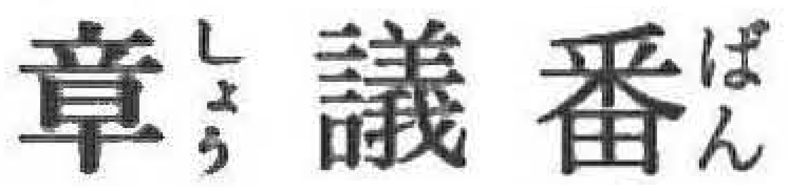
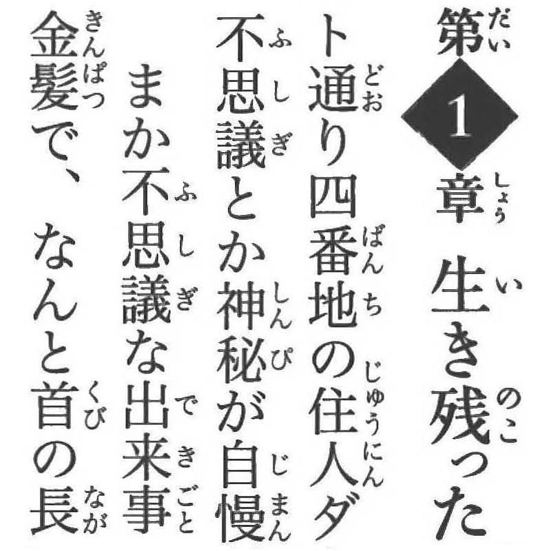
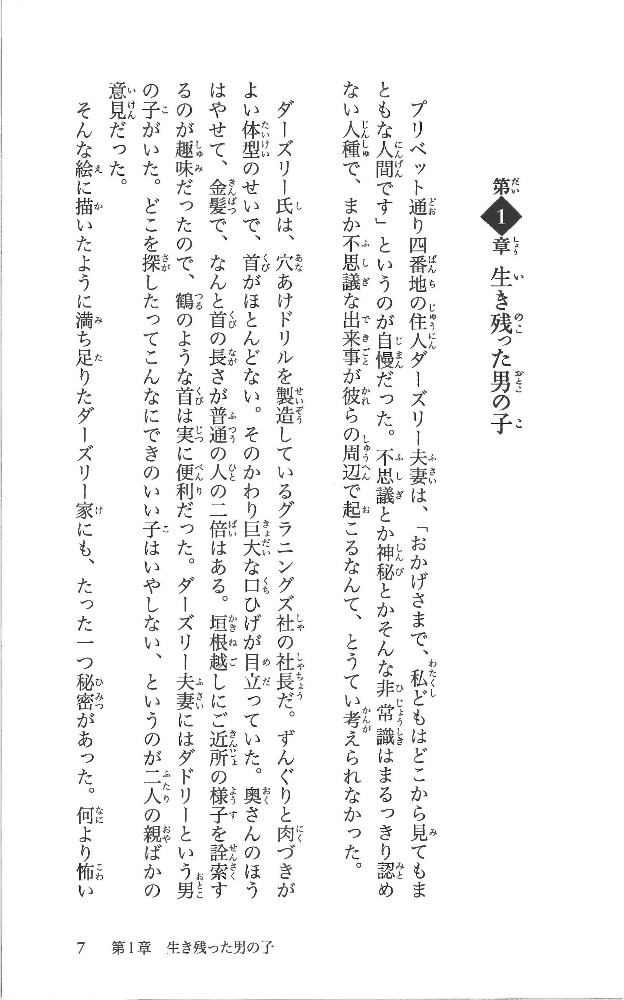

1DollarScan image quality
=========================

This page discusses my disappointment with images produced by the [1DollarScan](https://1dollarscan.com/) destructive book-scanning service and how I tried to clean up and improve the quality of the scanned page images they produced.

Note: when using 1DollarScan, I selected the additional cost options of 600 DPI (rather than 300 DPI) and angle correction (HQT).

Here's a 6x zoom, that shows some of the issues seen in the scan 1DollarScan did of the first page of the first chapter of the all-furigana Japanese version of [Harry Potter and the Philosopher's Stone](https://www.amazon.co.jp/-/en/dp/4863898606).



Looking at the furigana of the first and last character, the small よ is almost unrecognizable and the dakuten is a blur. And there's lots of noise around the strokes of the middle character. This is not a result of the scanning process (which looks to have been very high quality) but is a result of saving the images as JPEGs.

You can skip all the discussion below and just look at the _Comparison_ section (that shows what can be achieved) and the _Summary_ section below.

Introduction
------------

The 1DollarScan process is nearly perfect but then let-down by saving the scanned images as highly compressed JPEGs (which are then bundled together into a PDF).

JPEG is a lossy image format that's great for photos but terrible for black-and-white text with its continuous alternation between white background and black text with hard edges between. On top of that, 1DollarScan uses an extremely high compression JPEG quality factor that makes things worse. ImageMagick determined a quality factor of 62 (and a sampling factor of 2x2), this is very low quality:

```
$ magick identify -format '%m %wx%h %Q %[jpeg:sampling-factor]\n' page-009.jpg 
JPEG 2540x4067 62 2x2
```

And the FBCNN model used below, determined an even worse factor of 50.

This is particularly frustrating as while JPEG significantly reduces image file size (presumably 1DollarScan's motivation), it's an old format and newer formats like [AVIF](https://en.wikipedia.org/wiki/AVIF) produce even smaller file sizes without the quality loss seen with these JPEG images.

E.g. for page 9 of my scanned book (which you can see below), the original 1DollarScan JPEG is 415KiB while the much higher-quality AVIF is just 282KiB, i.e. more than 30% smaller.

Extracting the JPEG images from the PDF
---------------------------------------

1DollarScan save the scanned images as JPEGs and then bundle them up into a PDF. The best way to extract the images from the PDF, creating one JPEG image per page, is using `pdfimages` from the [Poppler library](https://en.wikipedia.org/wiki/Poppler_(software)). This extracts each image exactly as-is, with no decoding and re-encoding that might make any quality issues worse.

On macOS, you can install it with Brew like so:

```
$ brew install poppler
```

I used Claude to create the simple script [`extract-pages.sh`](extract-pages.sh) that given a PDF, like the ones created by 1DollarScan, and an output directory, will extract all the images in the PDF to the output directory. Use it like so:

```
$ ./extract-pages.sh my-scanned-book.pdf page-images
...
$ ls page-images
page-001.jpg  page-054.jpg  page-108.jpg  page-162.jpg  page-216.jpg
page-002.jpg  page-055.jpg  page-109.jpg  page-163.jpg  page-217.jpg
page-003.jpg  page-056.jpg  page-110.jpg  page-164.jpg  page-218.jpg
...
```

Image cleanup
-------------

I looked at a lot of options for eliminating the artifacts and noise introduced by saving the images as highly compressed JPEGs.

I started with the simplest to use option which was [Upscayl](https://upscayl.org/) but even with the _Digital Art_ model, the results weren't great for these black-and-white text scans.

After examining various approaches, I settled on comparing two approaches using the [V3 IllustrationJaNai denoise and detail models](https://github.com/the-database/MangaJaNai/releases/tag/3.0.0):

* In the first, I used just the five _denoise_ models on their own.
* In the second, I first used the [Flexible Blind JPEG Artifacts Removal (FBCNN)](https://github.com/jiaxi-jiang/FBCNN) model to remove the JPEG artifacts and then used the six IllustrationJaNai _detail_ models.

Note: the JPEG noise and artifacts were so pronounced, that using the _detail_ models on their own just made these more obvious, so I gave up on that quickly.

### Cropped image

The full-size page images are 2540x4067 pixels. Running lots of experiments on an image this large would be very time-consuming (and require massive amounts of VRAM for the larger models that I used below).

So I cut out a 800x800 pixel image from the start of the first chapter in the book I got scanned. You can see it in the _Comparison_ section below. If you know Japanese, you'll see it doesn't make any sense - I actually cropped together bits of the page that I felt showed the worst issues with the page.

The cropped image was saved as a PNG that preserved all the JPEG artifacts as they were without making things worse.

### Running the models

I ran my original `crop.png` image through the best denoise model (DAT2) and the result was [`4x-dat2.png`](images/4x-dat2.png).

When using the FBCNN model, you can either let it automatically determine the JPEG quality factor used when the image was encoded as JPEG or you can tell it what the factor is. I tried manually setting the factor and repeatedly adjusting it and rerunning the model until I'd achieved the best result. I then compared this with the automatically determined result. The automatically determined result was as good as my time-consuming manual approach, so I went with it.

The result was [`crop-fbcnn-auto.png`](images/crop-fbcnn-auto.png).

I then ran this through the best detail model (HAT L) and the result was [`4x-fbcnn-hat-l.png`](images/4x-fbcnn-hat-l.png).

You can see the peak VRAM and time costs for _all_ IllustrationJaNai models below. The FBCNN model was far more lightweight and used a peak 1.08 GiB VRAM for my `crop.png` image (and took 1.36s which isn't comparable with the times seen below for the IllustrationJaNai models, as they were run on a G4 GPU while I used a free T4 GPU for FBCNN).

Note: you can find links to the Colab notebooks below.

### Comparing results

I then downscaled the resulting images to the original 600 DPI. This may make the whole process sound rather pointless, but I didn't want more than 600 DPI, the point was instead to eliminate JPEG artifacts are recover detail lost as consequence of saving the images as JPEG.

Note: which downscaling filter to use is an issue in its own right, see the section below on how I chose the best filter.

The downscaled 600 DPI results were [`dat2.png`](images/dat2.png) and [`fbcnn-hat-l.png`](images/fbcnn-hat-l.png).

In my opinion using the best _denoise_ model on its own beat the combination of FBCNN with the best _detail_ model.

This makes `dat2.png` the winner. But DAT-2 is a very expensive model to run, so I wanted to see if I could achieve results that were nearly as good using the more light-weight denoise models.

I ran all the denoise models and compared the resulting images with `dat2.png` using ImageMagick's SSIM (Structural Similarity Index) as the metric:

```
$ magick compare -metric SSIM dat2.png other-model.png null
```

The results were (all compared at 600 DPI):

| Model | SSIM |
|-------|------|
| FDAT_M_47k_fp16 | 64.465 |
| FDAT_M_unshuffle_30k_fp16 | 88.5996 |
| FDAT_XL_32k_bf16 | 111.021 |
| SPAN_S_30k_fp16 | 142.79 |
| `crop.png` | 726.618 |

As expected, `crop.png` generates the worst match.

Note: the fact that the match "distances" don't exactly reflect the quality ordering on the release page for the models, does raise questions about some of my assumptions in this whole approach.

On looking at the results, I felt _FDAT M unshuffle_ looked almost as good at _DAT2_ while being far less demanding in terms of VRAM (see numbers below).

### The winner

In the end, I chose _FDAT M unshuffle_ as the winning model.

Scaled to 600 DPI, normalized (see section below) and converted to AVIF (see section below), the result was [`unshuffle-normalize-600dpi.avif`](images/unshuffle-normalize-600dpi.avif) (you can see it below in the _Comparison_ section).

Comparison
----------

The original image with JPEG artifacts:



The 600 DPI normalized _FDAT M unshuffle_ AVIF result:


And for reference, a clean pure digital 600 DPI reconstruction:


For details on how the pure digital version was created, see [`pure-digital`](pure-digital).

Full-size page comparison
------------------------

Here's a full original JPEG page image:



And here's the 600 DPI normalized _FDAT M unshuffle_ AVIF result:


Notebooks
---------

You can find the two Colab notebooks, that I created, here:

* [`notebooks/fbcnn_jpeg_cleanup.ipynb`](notebooks/fbcnn_jpeg_cleanup.ipynb)
* [`notebooks/upscaling.ipynb`](notebooks/upscaling.ipynb)

Each notebook includes an _Open in Colab_ link at the top to open your own copy in Colab.

Summary
-------

Here is a summary of the steps taken above. First, extract the images from the 1DollarScan PDF:

```
$ ./extract-pages.sh my-scanned-book.pdf page-images
```

In the root folder of your _Google Drive_, create a directory called `colab`. Within it create a directory called `upscaling` and within that three subdirectories called `models`, `input` and `output`.

Upload all the images in `page-images` to the `input` directory on _Google Drive_.

Download the `IllustrationJaNai_V3denoise.zip` file from the _Assets_ section of the V3 IllustrationJaNai [release page](https://github.com/the-database/MangaJaNai/releases/tag/3.0.0). Extract the ZIP file and upload the `2x_IllustrationJaNai_V3denoise_FDAT_M_unshuffle_30k_fp16.safetensors` model file to the `models` directory on _Google Drive_.

Open the Upscaling notebook, go to the _Runtime_ menu and select _Change runtime type_, you'll need at least an A100 GPU rather than one of the free T4 GPUs (the T4 has 15GiB VRAM, the A100 has 40GiB, the H100 has 80GiB and the G4 has 96GiB).

Then Run each of the cells in the Upscaling notebook (see _Notebooks_ section above) in turn and then find the results in the `output` directory on _Google Drive_.

Download the `output` image files and for each file, normalize it, downscale it and convert it to AVIF like so:

```
$ magick upscaled-page.png \
    -colorspace Gray -normalize \
    -filter Triangle -resize 50% \
    -depth 8 -define heic:speed=2 -define heic:chroma=444 -quality 65 -strip \
    result-page.avif
```

That's it.

Note: running the _FDAT M unshuffle_ model on the small 4.53x6.89 inch 600 DPI pages of my book required just under 30GiB VRAM (and it's one of the most light-weight IllustrationJaNai _denoise_ models).

Additional notes
----------------

The sections below go into further detail on some of the topics discussed above.

### Downscaling

When downscaling images before, I'd generally tended the use the [Lanczos](https://en.wikipedia.org/wiki/Lanczos_resampling) [ImageMagick filter](https://usage.imagemagick.org/filter/). However, like JPEG, this (to my surprise) turns out to be a terrible algorithm for text. Lanczos results in artifacts variously referred to as halos, lobes and ringing.

It turns out that far simpler filters actually perform better for black and white text. I tried the following selection and compared the results:

```
$ magick in.png -filter Box -resize 25% 01.png
$ magick in.png -colorspace RGB -filter Box -resize 25% -colorspace sRGB cs-01.png

$ magick in.png -filter Triangle -resize 25% 02.png
$ magick in.png -colorspace RGB -filter Triangle -resize 25% -colorspace sRGB cs-02.png

$ magick in.png -filter Mitchell -resize 25% 03.png
$ magick in.png -colorspace RGB -filter Mitchell -resize 25% -colorspace sRGB cs-03.png

$ magick in.png -distort Resize 25% 04.png
$ magick in.png -colorspace RGB -distort Resize 25% -colorspace sRGB cs-04.png

$ magick in.png -filter RobidouxSharp -distort Resize 25% 05.png
$ magick in.png -colorspace RGB -filter RobidouxSharp -distort Resize 25% -colorspace sRGB cs-05.png
```

If you're wondering what the conversions to the `RGB` colorspace and back are about, it's about converting to linear light intensity (where the averaging will work out from a math perspective), performing the downscale, then converting back to perceptually uniform light intensity. It _should_ result in better results but for reasons you can Google, it actually looks a little worse in this context.

In the end, I chose `-filter Triangle -resize 25%` with no colorspace conversion. You might choose differently if doing the same comparison.

### Normalizing

The blackest black in the scans is quite far from pure black, to fix this I used ImageMagick's `-normalize`:

```
$ magick in.png -colorspace Gray -normalize out.png
```

`-normalize` is essentially a shortcut for `-contrast-stretch 2%x1%`. With `-contrast-stretch`, you can fine tune, what percentage of the darkest pixels squash to black and the same for the lightest. Using 2% for dark and 1% for light is quite aggressive, and you can see this above in the chapter number (the digit 1 enclosed in a black diamond) where the lower serifs of the digit 1 become a little darker than desirable, but on the whole I think it works well.

### Converting to AVIF

The AVIF encoding defaults are best suited for using it as a drop-in replacement for JPEG. Some additional arguments are needed to achieve the best results for black-and-white text.

I used:

```
$ magick in.png -colorspace Gray -depth 8 -define heic:speed=2 -define heic:chroma=444 -quality 65 -strip out.avif
```

For full details, ask an LLM, but:

* `speed=2` means the encoder should produce better results than the default (at a small-ish speed cost).
* `heic:chroma=444` is redundant when used with `-colorspace Gray` but for a color image it would keep edges crisp (the default would smear them slightly).
* `-quality 65` is essentially perceptually lossless (the AVIF quality scale is very different to JPEG where 65 would be very lossy).

### IllustrationJaNai stats

The following tables show the peak VRAM and time costs for the various V3 IllustrationJaNai models when upscaling my `crop.png` sample.

As you can see, the VRAM and time costs are significant even for this small 800x800 pixel sample. All times are for a G4 GPU.

No tiling is used so these costs will increase significantly for a full page.

First the denoise models:

| Model | VRAM | Time |
|-------|------|------|
| 2x denoise_FDAT_M_unshuffle_30k_fp16 | 2.16 GiB | 0.28s |
| 2x denoise_SPAN_S_30k_fp16 | 2.65 GiB | 0.10s |
| 4x denoise_FDAT_M_47k_fp16 | 7.71 GiB | 0.09s |
| 4x denoise_FDAT_XL_32k_bf16 | 11.39 GiB | 1.76s |
| 4x denoise_DAT2_27k_bf16 | 19.34 GiB | 2.60s |

Now, the detail models:

| Model | VRAM | Time |
|-------|------|------|
| 2x detail_FDAT_M_unshuffle_40k_fp16 | 2.01 GiB | 0.04s |
| 2x detail_SPAN_S_40k_fp16 | 2.66 GiB | 0.02s |
| 4x detail_FDAT_M_40k_fp16 | 7.72 GiB | 0.06s |
| 4x detail_FDAT_XL_27k_bf16 | 11.39 GiB | 1.75s |
| 4x detail_DAT2_28k_bf16 | 19.34 GiB | 2.63s |
| 4x detail_HAT_L_28k_bf16 | 33.56 GiB | 4.12s |

Note: the same models types exist for both denoise and detail, except for HAT L, which only exists for detail.
