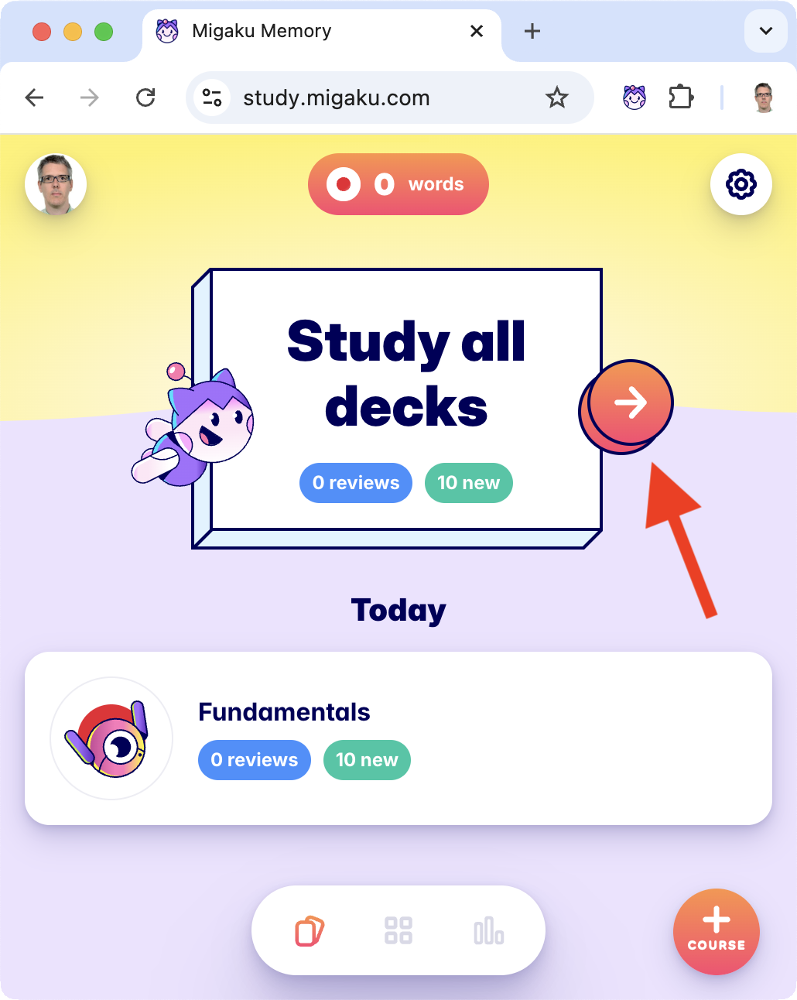

Japanese
========

Notes on starting to learn Japanese

Current plan
------------

**1.** Learn hiragana and katakana using resources below.

Using the _JapanesePod101_ lesson series (see below) and the Hiragana and Katakana Pro apps for drilling. And the self-study workbook [Learning Japanese Hiragana and Katakana](https://www.amazon.com/dp/4805312270) and the [Genkouyoushi notebook](https://www.amazon.com/dp/B08D4RPJBN) for writing practice.

**2.** Learn all kanji using RTK and Skritter (and possibly using WaniKani later to learn readings) - see [`skritter.md`](skritter.md) for relevant Skritter decks. Read the Kanshudo guide to reading kanji.

**3.** Complete Genki 1 using the self-study material from _ToKini Andy_ (kickstart with this [video](https://www.youtube.com/watch?v=S55aWpRaV44), [playlist](https://www.youtube.com/playlist?list=PLA_RcUI8km1NMhiEebcbqdlcHv_2ngbO2) and [site](https://www.tokiniandy.com/)), along with the Tango N5 book (_ToKini Andy_ suggests more actively learning this vocabulary than the chapter-by-chapter vocabulary introduced by Genki) and possibly using the Bunpro grammar webapp.

**4.** Get to a point where I can use Satori Reader.

Will set up Anki as described by _Jouzu Juls_ and _Trenton_.

Tofugu
------

I've come across many excellent resources, but one really stands out - it kept on coming up again and again when looking into any particular aspect of learning Japanese. It's the Tofugu website.

At this stage, I've got to the point where if I find something covered on Tofugu or reviewed on Tofugu, I tend to view that as the last word or the definitive take on the thing.

The only downside is that the articles tend to be huge, they're anything but bitesize and you have to commit real time to reading and digesting them. But it's worth it.

Noteable articles:

* [A roadmap to learning Japanese from zero](https://www.tofugu.com/learn-japanese/).
* [A guide to Japanese pronunciation](https://www.tofugu.com/japanese/japanese-pronunciation/) - I like Tofugu as he doesn't try to over simplify. This article possibly goes to far in the other direction, especially for something that's a real getting-started aspect of things - trying to make the right sounds from the get go. At points it feels like a introductory lecture to a university linguistics course. But there's really good information here. I suspect tho' that most beginners will go mad or give up if they keep on reading through the pitch accent section (and aren't actually doing this as part of a linguistics course).
* [Learn kanji with radicals and mnemonics](https://www.tofugu.com/japanese/kanji-radicals-mnemonic-method/) - this is really about the "mechanics" of kanji, i.e. what you should understand about kanji - radicals, readings - _before_ you start trying to learn them. It also makes clear (as does every resource introducing kanji) that individual kanji aren't words, it's kanji combined with other kanji and/or kana that make up Japanese vocabulary.
* [On'yomi and kun'yomi - what's the difference](https://www.tofugu.com/japanese/onyomi-kunyomi/) - all about on'yomi (Chinese derived) and kun'yomi (Japanese) readings, including how to know which reading will apply in a given situation and choosing the "best" reading to learn first.
* [The best kanji learning programs](https://www.tofugu.com/japanese/best-kanji-learning-programs/) - program doesn't mean application, this article covers books, apps, websites, videos and more.

Many other Tofugu resources are linked to below for specific topics, e.g. learning kana.

Tofugu is also the creator of [WaniKani](https://www.wanikani.com/), a web app that's one of the most popular ways to learn kanji. There's a lot of disagreement about what the "best" way to learn kanji is, and some people are convinced WaniKani is not the way to do things while others find it an amazing tool. I'm starting my journey so can't comment. Tofugu himself is refreshingly measured in his take, he has large articles on the mechanics of learning kanji, points out that he created WaniKani to capture his insights into the process but doesn't suggest it's a silver bullet or the only way to do things. It's this kind of thing that makes his content feel very trustworthy.

Note: Tofugu also has a YouTube [channel](https://www.youtube.com/@Tofugu/videos) but it's an odd contrast with his website - while it does have learning Japanese content, it's more a personal channel rather than a core learning resource.

Speed running the basics
------------------------

These playlists are too lightweight to provide a real grounding in grammar etc. but I found them nice for providing some kind of basic overview:

* ToKini Andy's [_Absolute Beginner Japanese_ playlist](https://www.youtube.com/playlist?list=PLA_RcUI8km1OvB9uN-8h0BSJnCLsHJvty).
* Japanese Ammo with Misa's [_Absolute Beginner Japanese_ playlist](https://www.youtube.com/playlist?list=PLd5-Wp_4tLqZor0fbsXtP7t6npWeE-2IU).
* _JapanesePod101_'s [Learn Japanese in 4 Hours](https://www.youtube.com/watch?v=XCILw-a0sdA) (the title is clickbait but...).

Yes, ToKini and Misa used identical names for their playlists!

ToKini Andy also has [_How I would learn Japanese_](https://www.youtube.com/watch?v=L1NQoQivkIY) which I think would have been a great first video for his beginner playlist.

TODO: rewatch this video and note down the core elements here.

Robin MacPherson has a [_Grammar Reference_ playlist](https://www.youtube.com/playlist?list=PLuIhQdwUVqqpq-aOnrEUjEq2oidCXbp9J) that he clearly imagined would develop into something much larger but he never got beyond the first five mini episodes. As someone who seems to be very interested in the mechanics of language learning, I thought he might bring something new to teaching the basics but that's not the case. At the start of his playlist, he mentions his upcoming course on learning Japanese through reading (working through nice graded readers) which sounds interesting but I can't find any other reference to this course via Google or on his [Patreon](https://www.patreon.com/robinmacpherson/collections). The only other Japanese-specific reader snippet that I could find from him is [here](https://www.youtube.com/watch?v=08eXk5PXVD8&t=695s) where he recommends the book [_Read Real Japanese_](https://www.tofugu.com/reviews/read-real-japanese/).

Tango N5 1000
-------------

The Japanese title for this book is はじめての日本語能力試験N5単語1000 (which could be translated as "1000 JLPT N5 vocab for beginners").

And the publisher's English title for the book is 1000 Essential Vocabulary for the JLPT N5.

But on the web, it's commonly called N5 Tango (N5単語 - tango being the word for vocab).

You can find it on Amazon [here](https://www.amazon.com/dp/4872179811/) (I don't know where the French "Trilingue en Japonais - Anglais - Chinois" in the Amazon title comes from - it's not even correct as the book is trilingual in Japanese, English and _Vietnamese_).

The audio files that go with the book can be found [here](https://ask-books.com/jp/978-4-87217-981-1/) on the publisher's website.

Yomichan
--------

Yomichan was the main browser extension for hovering over words on any webpage to see dictionary definitions.

**However**, the extension repo has been archived, the project sunsetted and the batton has been passed to Yomitan.

At this stage, I have quite a lot of Yomitan notes, so I've split them out into [`yomitan.md`](yomitan.md).

Han unification
---------------

As a geek, I thought [Unicode](https://en.wikipedia.org/wiki/Unicode) had solved all text encoding problems. However, it seems that a decision called Han unfication (taken back when Unicode was strictly 16 bits and they wanted to limit the number of code points needed for the [CJK characters](https://en.wikipedia.org/wiki/CJK_characters)) means that when looking at text, you may see characters rendered using a Chinese variant rather than a Japanese one. And these variants can be dramatically different:


Whether you see 直 in its Chinese or Japanese variant depends on the font family being used. This is obviously a serious issue if you're learning kanji and is covered in the Anki setup videos linked to below. It's also something to be aware of when using anything else, e.g. Chrome etc.

For more on Han unification, see the [Wikipedia article](https://en.wikipedia.org/wiki/Han_unification) (or the more digestible [subsection](https://en.wikipedia.org/wiki/Unicode#Han_unification) in the main Unicode Wikipedia article).

Fonts
-----

If you want to compare how characters look in many different fonts then try [Google Fonts](https://fonts.google.com/?subset=japanese&preview.text=%E7%9B%B4%E5%9C%A8%E5%AD%98%E3%81%B2%E3%82%AB&preview.text_type=custom&script=Jpan) with the language filter set to Japanese and with the particular characters you're curious about in the preview text area.

### Android

Open the _Google Keep_ app and paste 直 into a new note. Looking at the image of Chinese and Japanese variants, which variant do you see?

On my Android Google Pixel 6a, I saw the Chinese variant.

The solution was surprisingly easy (from this Reddit [post](https://www.reddit.com/r/LearnJapanese/comments/tvwpln/) - just go to _Settings / System / Languages / System Languages_ and add Japanese as a language:


Then leave your phone alone for about 5 minutes as it goes off to Google Play and queries it for additional language data for every app on your phone and things behave a little oddly while this is happening.

The only obvious difference after doing this is that the Japanese variant of 直 is shown in apps like Google Keep rather than the Chinese variant.

Anki
----

How to use Anki and how to best set it up:

* ["You Should Be Using Anki"](https://www.youtube.com/watch?v=_MWtbI4IwfU) by _Trenton_ - a nice intro to using and setting up Anki for Japanese where he doesn't go mad on add-ons. He covers vocab vs sentence decks (he's not particularly anti vocab cards).
  He also recommends the [Kaishi 1.5K deck](https://github.com/donkuri/Kaishi) as a good bootstrapping deck - i.e. acquire enough basic vocab that you can actually make sentence cards where all but one of the words in the sentence is unknown to you.
* ["How to Install & Use Anki"](https://www.youtube.com/watch?v=DcY2Svs3h8M) by _Jouzu Juls_. He also has videos on [fixing the Han unification issue](https://www.youtube.com/watch?v=wlmfncz-Wxg), [fixing pitch accent display](https://www.youtube.com/watch?v=gQFiLNL8yes) and an updated 2024 video on [Anki plugins](https://www.youtube.com/watch?v=ahGkFX4JPc8).

_ToKini Andy_ dosn't have a Anki getting-started video but he does think integrating Yomitan with Anki is the way to "supercharge your Japanese reading" and covers setting up the HTML etc. for the perfect cards and covers two addons - [AnkiConnect](https://ankiweb.net/shared/info/2055492159) (that allows external tools, like Yomitan, talk to Anki) and [Edit Field During Review](https://ankiweb.net/shared/info/385888438) (that allows you to edit cards while reviewing them). Both addons are open source.

For a clean simple template, see [Crop Theft](https://github.com/Kuuuube/crop-theft) - there's no end of these templates but this one comes from someone who seems to put some effort into developing Japanese related tools (see [here](https://github.com/Kuuuube#japanese-tools) on GitHub). See the FAQ if you don't see sentences etc. as expected when reviewing the cards. I suspect tho' that the template that's part of the Kaishi 1.5K deck is at least as good and probably the one to go with.

### Decks

There are lots of decks in the [Japanese shared-decks section](https://ankiweb.net/shared/decks?search=japanese&sort=rating) of the AnkiWeb site.

However, I'm not crazy about how shared decks are managed/maintained on AnkiWeb. The [Kaishi 1.5K deck](https://github.com/donkuri/Kaishi) is one of the few ones with a clear source and a clear mechanism for handling updates (via GitHub) - for the others, it's generally unclear who they come from and you've got to go on the ratings.

It's clear many of the decks are unmaintained (which may or may not be an issue - like a good book, they may be perfect and not require anything in the way of maintenance).

The most popular deck by a long shot in the Tae Kim deck from _Japanese like a breeze_. A few of the highly rated decks are targetting Chinese speakers rather than English speakers.

The various Core 2000 decks have been popular over the years but the Kaishi 1.5K deck seems like a better choice today with it's aim to be a more openly maintained equivalent with better quality control.

There are many RTK decks - the most popular one is this [one](https://ankiweb.net/shared/info/1654787298) (92 likes - last update Dec 2020). **Note**: apparently you should click on each keyword as you learn it, this will take you to the relevant Koohii page - you can then choose your favorite story and copy and paste it into the _Story_ field in the card.

Most of its data comes from this [GitHub project](https://github.com/hochanh/hochanh.github.io/tree/master/rtk) which you can find running [here](https://hochanh.github.io/rtk/) on GitHub pages (e.g. take a look at it's [RTK1-v6 page for 古](https://hochanh.github.io/rtk/%E5%8F%A4/index.html)).

There are other popular RTK decks - like this [one](https://ankiweb.net/shared/info/1862058740) (83 likes - last update Apr 2017) and this [one](https://ankiweb.net/shared/info/2009196675) (54 likes - last update Jul 2018).

Which one you choose may depend on your preferences, the one with 92 likes is very minimalist, with not much more than the character and the RTK keyword (and uses a font designed to show the stroke order) - and you paste in a story. This seems closest to the intention of RTK - i.e. don't get overwhelmed at the start. The one with 83 likes is the opposite, it has readings and lots of other details to go with each character and two already provided stories from Koohii. The 54 likes one is similar, though not quite so overwhelming.

Note: some of these decks get outraged downvotes due to the NSFW stories they contain - this is a bit unfair as these (and many other desks) just mine a service called [Koohii](https://kanji.koohii.com/) (covered elsewhere on this page) for the most popular user submitted stories.

The one thing I think the 92 likes one is missing is the constituents, i.e. the known parts in italics that RTK points out for each new kanji e.g. the constituents for 式 (style) are 工 (craft) and the radical 弋 (arrow). But I guess that could easily be added at the same time that you add a story to a given card.

Other very popular decks include the [All in One Kanji Deck](https://ankiweb.net/shared/info/798002504) (225 likes - last updated Apr 2017) but it seems to follow the route of treating kanji individually, each with a huge number or readings, rather than the approach lots of other people argue in favor of - a more digestible vocabulary based approach that introduces each new readings in the context of a concrete sentence where it's used.

While not particularly popular, I'll link to them here as I'm interested in using JLPT Tango N5:

* [22 likes - last updated Jun 2021](https://ankiweb.net/shared/info/419481234)
* [14 likes - last updated Feb 2020](https://ankiweb.net/shared/info/1295779105)
* [12 likes - reuploaded Apr 2023](https://ankiweb.net/shared/info/866090213)

They may be good as they are or serve as a convenient basis for making cards e.g. by using their audio or already typed in sentences.

Mentioned elsewhere in this page:

* The Tae Kim deck from _Japanese like a breeze_.
* The pitch accent deck from _Matt vs Japan_ and _Ken Cannon_.

Koohii
------

Koohii is a website for learning RTK. It's big plus is that it encourages users to submit stories which can be a great help if you're not great at inventing them yourself (although if you can, the process of inventing a story should also help it stick).

Perhaps unsurprisingly a _lot_ of these stories are NSFW.

But many of them are interesting and inventive. For an example take a look at character 16 in lesson 2 - [古](https://kanji.koohii.com/study/kanji/16). On the whole, I'd collapse the _New & updated stories_ section and just look at the _Shared stories_ section where you can see the stories that have been highly stared by other users.

The original RTK stories are **not** here as they are copyrighted but you could just get RTK in e-book or PDF format and copy them in when creating your own customized non-shared cards.

Koohii has a big [help section](https://kanji.koohii.com/learnmore). It uses its own SRS system and you review the cards online. It'd be nice of there was Anki integration (there is an export to CSV which could be crunched somehow for import into Anki).

iOS and Android dictionary
--------------------------

_Japanese_ used to be a very popular Japanese dictionary for both iOS and Android.

The site still exists [here](https://www.japaneseapp.com/) but it seems to be dead at this stage, its Android [Play page](https://play.google.com/store/apps/details?id=com.renzo.japanese&pli=1) shows it isn't available for any recent phones. And its iOS [App Store page](https://apps.apple.com/us/app/japanese/id290664053) shows it hasn't got an update since 2019.

**Update:** on Android, I now use the app [Japanese Dictionary Takoboto](https://play.google.com/store/apps/details?id=jp.takoboto) (or just use Jisho in my browser).

Netflix
-------

Subscribing to Netflix Japan seems to have become very difficult in recent years - they've really clamped down on VPNs. And it's unclear to me if one can subscribe without a Japanese credit card.

It's not obvious that one can get a Japanese credit card without a non-tourist residence visa and Japanese address. It _may_ be possible to get a prepaid virtual card, without such identity verification, from [WebMonkey](https://en.komoju.com/blog/payment-method/webmoney/) or possibly [Kyash](https://thebestjapan.com/kyash-an-easy-alternative-to-credit-cards/) (I don't know if they have a virtual card or just a physical one).

Both NordVPN and ExpressVPN make a big deal of being suitable for use with Netflix but users report being frequently blocked.

For a take on the best VPN services for 2024, see Wired's [best VPN story](https://www.wired.com/story/best-vpn/) and Wirecutter's [similar story](https://www.nytimes.com/wirecutter/reviews/best-vpn-service/). Both recommend Mullvad for privacy, which for a Hacker News reader sounds convincing and makes the articles seem more credible that the usual reviews that seem more like shills for NordVPN and ExpressVPN (the two VPN providers that are clearly spending the most on advertising). Being good at privacy doesn't imply a focus on circumventing geo-blocking, which is what one is looking for to access Netflix Japan and other Japanese streaming services - for this the Wired article suggests Surfshark VPN.

Note: once you've signed up to Netflix in a particular location, it is possible to mark yourself on indefinite holiday in another location so, it may be possible to simply switch to your own location and stop using a VPN.

You can find whether Netflix in your region has much Japanese language content using [uNoGS](https://unogs.com/) (unofficial Netflix online Global Search).

Just click _Advanced Search_, then _Uncheck All_ countries and just check your country, then set _Audio_ to _Japanese [Original]_ (and maybe set _Order_ to _Rating_) and click _Search_.

If you're logged into the Netflix website you can also search like this <https://www.netflix.com/browse/audio/jp>

Note: even Netflix Japan has none of the anime listed in [Top 10 Anime for Learning Real Japanese (JLPT N5 N4 level)](https://youtu.be/lktcZc9dYSI) (see below for the anime covered in this video).

Crunchyroll
-----------

[Crunchyroll](https://www.crunchyroll.com/) has lots of anime but oddly it doesn't have Japanese subtitles. There are many theories as to why, e.g. that it's content is specifically licensed for non-Japanese markets.

### Download subtitles (for Crunchyroll, Netflix and more)

But there are ways to get around this, e.g. using the Chrome extension [asbplayer](https://chromewebstore.google.com/detail/asbplayer-language-learni/hkledmpjpaehamkiehglnbelcpdflcab). It's open source and also available [here on GitHub](https://github.com/killergerbah/asbplayer)).

Or using [substital](https://substital.com/) or [Jimaku Player](https://github.com/sheodox/jimaku-player/) (tho' development stopped 2 years ago).

[jimaku.cc](https://jimaku.cc/) seems to be the place to download subtitles.

Note: Jimaku Player isn't associated with jimaku.cc - it's just one of many tools for playing subtitles from jimaku.cc.

asbplayer seems to be the most popular player in this space, is being actively developed and is recommended by people like Refold (see this [video](https://www.youtube.com/watch?v=GYsf-NOVoYc)).

Beginner anime
--------------

Note: where a series is both an anime and a manga, I've linked to the Wikipedia anime episode guide rathe than the manga page.

_Mochi real Japanese_ (in this [video](https://youtu.be/lktcZc9dYSI)) recommends (all are for beginners but she includes a difficulty and speed rating, 1 being the easiest):

* [Chibi Maruko-chan](https://en.wikipedia.org/wiki/Chibi_Maruko-chan) (ちびまる子ちゃん, lit. "Little Maruko-chan") - level 1, speed 2.
* [Doraemon](https://en.wikipedia.org/wiki/Doraemon_(2005_TV_series)) (ドラえもん) - level 2, speed 2 (note there's the original 1979 version and a 2005 remake).
* [Azumanga Daioh](https://en.wikipedia.org/wiki/Azumanga_Daioh) (あずまんが大王) - level 2, speed 2.
* [Nichijou (aka My Ordinary Life)](https://en.wikipedia.org/wiki/List_of_Nichijou_episodes) (日常) - level 3, speed 2.
* [My Neighbor Totoro](https://en.wikipedia.org/wiki/My_Neighbor_Totoro) (となりのトトロ) - level 2, speed 2.
* [Kemono Friends](https://en.wikipedia.org/wiki/Kemono_Friends) (ものフレンズ) - level 3, speed 1.
* [Hetalia: Axis Powers](https://en.wikipedia.org/wiki/List_of_Hetalia:_Axis_Powers_episodes) (ヘタリア Axis Powers) - level 4, speed 3 (the whole idea sounds amazingly culturally insensitive).
* [Polar Bear Café (aka Shirokuma Cafe)](https://en.wikipedia.org/wiki/List_of_Polar_Bear_Caf%C3%A9_episodes) (しろくまカフェ) - level 2, speed 2.
* [Maison Ikkoku](https://en.wikipedia.org/wiki/List_of_Maison_Ikkoku_episodes) (めぞん一刻, lit. "Ikkoku House") - level 4, speed 3 (comes up in lots of other people's recommendations too).

_That Japanese Man Yuta_ in [How to Learn Japanese with Anime](https://www.youtube.com/watch?v=AXmPavo_quc) (at 5m 50s) recommends [Teasing Master Takagi-san](https://en.wikipedia.org/wiki/List_of_Teasing_Master_Takagi-san_episodes) (からかい上手の高木さん, lit. "Good at Teasing, Miss Takagi")

In this [video](https://www.youtube.com/watch?v=YbcceTdyoQs), he recommends:

* Teasing Master Takagi-san - as above - he calls it his "number one recommendation".
* [Spirited Away](https://en.wikipedia.org/wiki/Spirited_Away) (千と千尋の神隠し, lit. 'Sen and Chihiro's Spiriting Away').
* [My Teen Romantic Comedy SNAFU](https://en.wikipedia.org/wiki/My_Teen_Romantic_Comedy_SNAFU_season_1) (やはり俺の青春ラブコメはまちがっている, lit. "My Youth Romantic Comedy Is Wrong, as I Expected") - he loves it but says it's more difficult and recommends it for more advanced learners.
* [Haikyu!!](https://en.wikipedia.org/wiki/Haikyu!!_season_1) (ハイキュー!!, lit. "Volleyball!!").

_Weeb Jail_ has a [playlist](https://www.youtube.com/playlist?list=PL-p7W9Jfmyda7wNKKOpO06AB2HrblVW-o) on learning Japanese with anime and in this [video](https://www.youtube.com/watch?v=DL3UL3CNmVc) recommends:

* [Space Brothers](https://en.wikipedia.org/wiki/List_of_Space_Brothers_episodes) (宇宙兄弟) - he does say this is driven by his interest in space and technology (which means he understands the context).
* [Your Name](https://en.wikipedia.org/wiki/Your_Name) (君の名は) - his favorite (that he's rewatched lots of time) - comes up again and again as a favorite of other people too.
* [Pokemon](https://en.wikipedia.org/wiki/Pok%C3%A9mon_(TV_series)) (ポケットモンスター) - I guess someone had to mention it but he then goes on to say that while it's easy most of it is Pokemon names and their attacks and suggest instead Doraemon or...
* [Crayon Shin-chan](https://en.wikipedia.org/wiki/List_of_Crayon_Shin-chan_episodes) (クレヨンしんちゃん).
* [Death Note](https://en.wikipedia.org/wiki/Death_Note_(2006_TV_series)) (デスノート).
* [Midnight Diner](https://en.wikipedia.org/wiki/Midnight_Diner_(Japanese_TV_series)) (深夜食堂) - actually live action rather than anime.

_ToKini Andy_ doesn't seem to have any anime-recommendation videos but he does have some interesting takes [here](https://www.youtube.com/watch?v=MeqU_RqJjsM) on the often recommended manga _Yotsuba to!_ (よつばと) (he points out that some of the grammar is deliberately wrong) and [here](https://www.youtube.com/watch?v=3nJVz5Bf9t0) on Dorohedoro (ドロヘドロ) (for N2 and N1 level learners only).

_Misa_ also doesn't have any anime-recommendation videos but she does have this [manga one](https://www.youtube.com/watch?v=ua5lkcDvl_o) (where she recommends _Yotsuba to!_, _Shirokuma Cafe_ and more).

Popular anime
-------------

There are no end of lists of most popular anime (e.g. this [one](https://movieweb.com/most-popular-anime-of-all-time/) from MovieWeb or this [one](https://www.cbr.com/best-anime-of-all-time/) from CBR - both sites were acquired by Valnet and have an identical visual look and an odd load-as-you-scroll scheme that means if you jump down to see their number one choice, you have to wait for the loading to catch up).

IMDB also let's you view all anime sorted by popularity [here](https://www.imdb.com/search/title/?keywords=anime) (where popularity is determined by how many people have visited the IMDB page for the series).

Anime that I keep coming across include ones like Doraemon and Shirokuma Cafe (see above) and:

* Dandadan
* Chainsaw Man
* Sakamoto Days
* Frieren: Beyond Journey's End
* Mob Psycho 100
* One Piece
* Naruto

### Animelon

While I don't want to recommend piracy, a lot of the anime one finds mentioned on YouTube and elsewhere are almost impossible to acquire legally in much of the world.

[Animelon](https://animelon.com/) hosts a well curated and huge library of pirated anime. And it seems actively geared towards helping learners with play-along transcripts (with the choice of Japanese with kanji or just hiragana or romaji along with translations and tests and exercises).

See their [about page](https://animelon.com/about) for much more - e.g. how you can customize subtitles and click on them for more details. It looks like a super resource and it's a pity it's not really legal.

There doesn't seem to be an obvious way to download their content and page loading and playback often takes a long time. Hosting and delivering video content isn't cheap and they seem to be generally underfunded (they take donations) and relatively frequently seem to disappear altogether for shorter or longer periods.

**Update:** see [here](https://github.com/Kuuuube/animelon_dl) for an Animelon downloader.

More piracy
-----------

Again, I don't want be seen to condone piracy, but I have wanted to get digital versions of physical books that I've bought so that it's easier to e.g. copy things from them into flash cards. I don't think it's reasonable that one should have to pay for a digital version for this purpose if one has already bought a physical copy and I'd rather not work with DRM encumbered digital copies.

The solution to this is to download digital copies from [Anna'a Archive](https://annas-archive.org/).

Pitch accent
------------

**TLDR;** do the Musicca training, the Minimal Pitch Trainer, Dogen's Emurse course and look at the Kotu test and the Matt vs Japan / Ken Cannon deck. Take a look at _Dogen_'s Patreon.

Pitch accent seems to be a controversial thing - some people seem to think it's essential and others that you can completely ignore it. _Metatron_ has a nice discussion of the "controversy" [here](https://www.youtube.com/watch?v=TwEw2WACbfc). Both he and ToKini Andy basically seem to say, you should probably ignore it until you're past N5 stage as there are more important things to focus on initially but that if you don't want your Japanese to sound weird, it's something you'll have to address eventually.

See _Dogen_'s [playlist](https://www.youtube.com/playlist?list=PLxMXdmBM9wPvsySiMoBzgh8d68xqKz1YP). It starts with lots of short videos and then ends with a 2h 30m lecture. His [Patreon](https://www.patreon.com/dogen) also has lots of pitch-accent, pronunciation and phonetics material.

**Update:** Dogen now has a course on the interactive pitch-accent platform [Emurse](https://emurse.io/courses) which he describes in this [video](https://www.youtube.com/watch?v=ido7aSi9axA). This looks great, in that it can show you if you're hitting the correct pitches as you try to mimic a native speaker. Intriguing, right at the end of the video (at 30m 42s) he says "if you're already using a pitch accent application, whether that's free or not ..." - so, are there competing applications and if so what are they? Are there also applications that work like this for e.g.:

* Drilling long and normal vowel length.
* The _r_ sound (and the fact that some say り is a special case).
* The _fu_ sounds.
* That you're giving equal time to each mora, e.g. not too little time to ん and not too much time to combinations like りゃ (by pronouncing it as it were りや). Or no more to く than う.

See _Jouzu Juls_'s japanese pronunciation [video](https://www.youtube.com/watch?v=aOxRYmWDaF4) that recommends _Dogen_'s video but adds really useful pointers, e.g.:

* Using [minimal pairs](https://en.wikipedia.org/wiki/Minimal_pair) - he recommends the paid [Migaku Pitch Trainer](https://pitch.migaku.io/) (there's a free demo version [here](https://pitch-demo.migaku.io/)) but also mentions a free alternative - see below, it's the one Trenton mentions too.
* And if the whole thing is a complete struggle, he recommends Musicca, a similar minimal pairs site, but for music that has a [pitch section](https://www.musicca.com/exercises/circle/12) and an [interval section](https://www.musicca.com/exercises/circle/18) to get your brain attuned to the whole idea.

Matt vs Japan has a video with the infamous Ken Cannon where they discuss pitch accent but importantly also have exercises (around the 6m 30s mark - but the bits before are also important, e.g. not confusing stress in English with pitch accent): <https://www.youtube.com/watch?v=SaNr2xa4n3Q>

The `README` for the deck they created is [here](matt-ken-pitch-accent-deck/README.md), for the actual deck itself you need to use the link in the description section of the YouTube video.

Trenton (in this [video](https://www.youtube.com/watch?v=7fvCb5_Nzq4)) suggests the Kotu [minimal pairs test](https://kotu.io/tests/pitchAccent/minimalPairs) (which is an open source [GitHub project](https://github.com/k3zi/kotu.kez.io)).

**Update:** probably not terribly relevant but for an alternative implementation see Kuuuube's version - GitHub [repo](https://github.com/Kuuuube/minimal-pairs) and the [online test](https://github.com/Kuuuube/minimal-pairs).

Basically every major Japanese YouTuber has a pitch accent lesson (in some cases I've used a title taken from the content if the real title wasn't very clear):

* _That Japanese Man Yuta_ - [How To Learn Japanese Pitch Accent The Simple Way](https://www.youtube.com/watch?v=jp22QXysMHg).
* _Jouzu Juls_ - [Learn pitch accent before speaking](https://www.youtube.com/watch?v=aOxRYmWDaF4) (already linked above).
* _Matt vs Japan_ - [How to hear pitch accent](https://www.youtube.com/watch?v=SaNr2xa4n3Q) (and see joint video with Ken Cannon linked above).
* _Japanese Ammo with Misa_ - [Pitch Accent & Pronunciation playlist](https://www.youtube.com/playlist?list=PLd5-Wp_4tLqYkSIsRtsPbLIa0HnHkNzQW).
* _Kaname Naito_ - [Japanese Pronunciation: Pitch Accent Basics](https://www.youtube.com/watch?v=K8E-cU19PMs) and the newer [Basics of Japanese Pitch Accent](https://www.youtube.com/watch?v=jt04eg9T2sE)
* _Speak Japanese Naturally_ - [Japanese Pitch Accent and Intonation playlist](https://www.youtube.com/playlist?list=PLFGs3d9Sobfgr4clmLcHUM_X4JBCyIP2n) - the first video is nice and short but with practical advise and some really clear rules.
* _Mochi real Japanese_ - [Japanese Pronuciation Practice](https://www.youtube.com/watch?v=D6wCNoFa0jU) (only very briefly touches on pitch accent at the 12m 10s mark).
* _Trenton_ - see above.
* _Dogen_ - see above.
* _JapanesePod101_ - see below.

Minimal pairs data
------------------

Minimal pairs are mentioned in the pitch accent section. But they're also relevant for e.g. long and short vowels. I tried googling for minimal pairs data but I didn't come across much.

Apparently, the [Fluent Forever Pronunciation Trainer decks](https://fluent-forever.com/product/fluent-forever-pronunciation-trainer/) feature minimal pairs. Note: the link is to the old Anki decks that are still available to purchase (for US$12 each). Fluent Forever now focuses on decks for their own app (which, rather sadly, gets mediocre reviews on iOS and poor reviews on Android).

There's this [Reddit post](https://www.reddit.com/r/japaneseresources/comments/183y3yi/list_of_4420_minimal_pairs/) where the author wrote a Python program to look for pairs in a data set of the 10,000 most frequent Japanese words on the internet, e.g. pairs like:

* じょうし and じょし
* さっき and さき

And the resulting Google Sheets [document](https://docs.google.com/spreadsheets/d/1V_VEpg7jB7Lrgih_8Qbx_embMaNbmp2tizFk7UCiyxI/).

Another hand-made set of Google Sheets can be found here on the [old Koohii forum](https://web.archive.org/web/20141018215154/http://forum.koohii.com/viewtopic.php?id=12246).

Japanese pronunciation
----------------------

TODO: See already links to pronunciation guides from Dogen, Mochi and others above.

_Campanas de Japanese_ has a nice pronunciation [playlist](https://www.youtube.com/playlist?list=PLGos75KF4PaQWko1d_WJEVSmH71QFaTa8) and covers IPA, long vowels, sokuon, rhythm, pitch and more.

_Japanese Ammo with Misa_ has a [nice one](https://www.youtube.com/watch?v=cRchrkpA5vs) too.

### Japanese R sound

Tofugu has a nice [short lesson](https://www.youtube.com/watch?v=V2wzUuGm7yw) to teach you what exactly to do to make this sound. I wish he'd included subtitles - it's hard sometimes to here if he's telling you to say da or la or asking you to start saying ra.

_Campanas de Japanese_ also goes over what's involved [here](https://www.youtube.com/watch?v=hpRArmZxfFM) and points out that _ri_ is a bit different.

See also this [video](https://www.youtube.com/watch?v=jUF5rAsaCKI) from _UBC eNunciate!_ (the tongue positions get clearer as they move from weird images of tongues moving within real people's mouths to diagrams).

Actually, there are no end of these videos - YouTube will start suggesting more and more once you watch one or two - try them and see what makes sense.

### Long vowels

_JapanesePod101_ has a [pronunciation lesson series](https://www.japanesepod101.com/lesson-library/ultimate-japanese-pronunciation-guide) that covers [pitch accent](https://www.japanesepod101.com/lesson/ultimate-japanese-pronunciation-guide-10-perfecting-pitch-accent-in-japanese?lp=171) and [long vowels](https://www.japanesepod101.com/lesson/ultimate-japanese-pronunciation-guide-8-the-secret-to-mastering-the-japanese-long-vowel?lp=171).

_JapanesePod101_, a little confusingly, often offers similar content multiple times presented by different teachers (though they also provide over-arching _pathways_ where they curate their currently recommended sequences of lessons for particular goals).

So, they also offer:

* [Kantan Kana #8: Hiragana や, ゆ, よ and long vowels](https://www.japanesepod101.com/lesson/video-s2-8-kantan-kana-8).
* [Why Does a U Extend an O?](https://www.japanesepod101.com/lesson/absolute-beginner-questions-answered-by-hiroko-4-why-does-a-u-extend-an-o) (there doesn't seem to be a similar one for _i_ extending _e_).

For a non-video take on things, including the odd issue with え and お sounds, see Coto Academy's [Long Vowels and Double Consonants](https://cotoacademy.com/pronunciation-in-japan-long-vowels-and-double-consonants-in-japanese/).

For an example of how you can probably over-think all this, see e.g. this _JapanesePod101_ [forum discussion](https://www.japanesepod101.com/forum/viewtopic.php?t=3245).

_JapanesePod101_ also have a [hiragana worksheets series](https://www.japanesepod101.com/lesson-library/learn-hiragana-with-worksheets) that includes a simple PDF [worksheet for long vowels](https://www.japanesepod101.com/lesson/pathway-lessons-57-hiragana-worksheet-long-vowels?lp=411) (with answer key)..

_Campanas de Japanese_ has a nice [long vowels video](https://www.youtube.com/watch?v=_MBcIAEmucY) that as well as covering the oddities of writing also covers the rhythm involved and is more helpful than most in how to listen out for these sounds.

Seth Clydesdale maintains a huge site [Genki Study Resources](https://sethclydesdale.github.io/genki-study-resources/lessons-3rd/) that includes a short double-consonants/long-vowel [listening exercise](https://sethclydesdale.github.io/genki-study-resources/lessons-3rd/lesson-1/literacy-wb-7/).

The MIT OpenCourseWare site makes their [hiragana resource](https://mitocw.ups.edu.ec/resources/res-21g-01-kana-spring-2010/hiragana/) available and there they have a handout and online exercises for double consonants and long vowels. Note: they use the less-common romanization system called [Nihon-shiki](https://en.wikipedia.org/wiki/Nihon-shiki_romanization#Romanization_charts) rather than the more common [Hepburn](https://en.wikipedia.org/wiki/Hepburn_romanization#Romanization_charts).

Videos with text
----------------

I've noticed various people using a tool that allows them to watch anime etc. and see the Japanese text along with all kinds of highlighting and additions for learners (e.g. pitch accent indicators, furigana and the ability to lookup words and export to Anki - in fact the Anki integrations seems very sophisticated, it can keep track of words that you've already got covered in your Anki decks).

I haven't looked into whether everyone is using the same tool but _Jouzu Juls_'s recommends Migaku. However, there's a legacy and new version, see his [video](https://www.youtube.com/watch?v=TGV1GrZlTvg) covering why you _may_ want to use the legacy version (his main issue may be resolved by the time you read this).

I haven't found a definitive video for the extension but try these:

* _Livakivi_'s [The ULTIMATE Guide to SENTENCE MINING!](https://www.youtube.com/watch?v=QBcQJESGQvc).
* _Budget Livakivi_'s [How to Use And Set-Up Migaku For Sentence Mining (Japanese)](https://www.youtube.com/watch?v=4tKINZwRzVs).

Yes, both are from the same person but he maintains two channels.

Migaku
------

Works with:

* Netflix
* Disney+
* YouTube
* Rakuten Viki

Rakuten Viki looks interesting in that it seems to be truly global (i.e. content available everywhere). However, it has only two Japanese anime series and seems to be mainly romantic dramas.

### Migaku resources

Migaku started as a browser extension and this is still the main feature. They've started adding to this - however, I think they could do a better job of making you aware what they have available. I found myself discovering content they have via other sites, e.g. they have a [demo pitch trainer](https://pitch-demo.migaku.io/) and if you subscribe you can access the [full version](https://pitch.migaku.io/) but I'm stumped if I can find a way to the full version via the Migaku dashboard:

This is what I've discovered so far:

* The Migaku [Chrome browser extension](https://chromewebstore.google.com/detail/migaku-really-learn-langu/lkhiljgmbeecmljiogckofcalncmfnfo).
* Their [courses](https://study.migaku.com/course-download).
* The full version [pitch trainer](https://pitch.migaku.io/).

The mechanics of starting a course are odd - there's just a big _Download_ button. You're left wondering if it's going to download some kind of application but if you press it, it just whirrs away for a short while and the _Download_ button is replaced with a _Browse Course_ and a _Start Studying_ button. So, if there is some downloading going on, it's something internal to the mechanics of the webapp and not downloading as most people understand it. And the information that you see, if you press _Browse Course_ feels like stuff you should definitely be able to see without the download step - i.e. what are the details of the course and what is it going to cover.

I find the navigation, when studying courses via the website, to be bizarre, e.g. while working your way thru the course they occassionally throw you into card learning sessions - I'm stumped if I can find an obvious way to navigate back to the course itself while in this mode.

The mobile app contains the same content that you can get to via the browser extension's dashboard. As of early 2025, all I can say is that while the app looks pretty it could do with a _lot_ of useability testing. Once you're familar with how something works it can seem obvious - I suspect this is the problem with the Migaku app (and with the web content), they should get in a few users and watch them go from zero and see what difficulties they encounter.

Maybe it all becomes clear if one works ones way thru the [Migaku User Guides playlist](https://www.youtube.com/playlist?list=PLKOLm5uwuh3Fed5Fbrn8uouwmWP-zxn03) on YouTube but while it's fine to teach users about all the features, it's not fine to use this as a mechanism to compensate for poor UI design (I'm talking here about useability - the app and website look beautiful).

There's also a large [FAQ](https://migaku.com/faq).

That Migaku has decided to move beyond just its core browser extension and move into actively teaching Japanese seems a fairly recent move. At the moment, the learning content seems rather jumbled in with the core purpose of the browser extension.

Migaku seems to be the marker leader in working with subtitles to video as a learning resource. The courses etc. feel like something quite distinct to this and there they're competing in a market with lots of established competitors - I imagine many might wish they carve this out as a separate operation or that they focus on elements, such as the pitch accent trainer, where they can fill odd holes in the existing market.

PS I also wish the dashboard, that you bring up via the Migaku extension button (to the left of the address bar in Chrome), would just open in a new tab rather than opening a new window.

**Update:** it turns out that you can return to studying a course by clicking the arrow to the the right side of the _Study all decks_. Obvious once you know, but another example of beauty over functionality, I just saw this box as a header for the rest of the content on the page and I'd view studying decks as just meaning card review, it'd never occur to me that it'd also mean study course content related to the decks:



### Migaku alternatives

In the end, I was disappointed at how hard it is to get Japanese content legally. If you don't care what you watch, there is lots of Japanese content available on Netflix outside Japan but if you come across something specific on YouTube and think "I'd like to watch that", the chances are it won't be available in Japanese internationally (and even within Japan, Netflix doesn't have many of the most popular anime).

So, given that Migaku only with content from suppliers such as Netflix that's a serious limit on the content for which it's useful.

For something similar for content from any source, including locally hosted content, see asbplayer mentioned elsewhere here.

YouTubers
---------

* [_Dogen_](https://www.youtube.com/@Dogen/videos) - _Dogen_ seems to be the king of japanese YouTubers but he mixes comedy (which may be a bit confusing/unhelpful for beginners) with serious content. Some of his content is only available to Patreons (see [here](https://www.patreon.com/dogen)).
* [_Jouzu Juls_](https://www.youtube.com/@JouzuJuls/videos) - he isn't in the top league as far as subscribers go but I really like a lot of his videos.
* [_Matt vs Japan_](https://www.youtube.com/@mattvsjapan/videos) - he's another japanese YouTube star but unfortunately he seems to have ruined his reputation through activities outside YouTube (basically don't buy anything that's pushed by Matt) and hasn't produced any new YouTube content since early 2022. This all seems very sad as he comes across as very personable and I enjoy his videos and his YouTube persona is hard to reconsile with his behavior elsewhere (which you can find covered in videos like [this](https://www.youtube.com/watch?v=cfuENBQdEYo), [this](https://www.youtube.com/watch?v=OAXEjGkICrs) and [this](https://www.youtube.com/watch?v=zChi-zofP18) - the last one from Metatron gives Matt the greatest benefit of the doubt - there are many more similar videos on YouTube).
* [_ToKini Andy_](https://www.youtube.com/@ToKiniAndy/videos) - he's another YouTube star in this space and he's the one who tries hardest to take a structured taught approach to his content, he has lots of [playlists](https://www.youtube.com/@ToKiniAndy/playlists) that e.g. go through learning the kanji or working thru Genki where he really tries to teach the content he's presenting. My feeling he's more practical than many other YouTubers and just gets down to learning rather than talking about learning. He's also migrated all his Patreon content to a subscription based [site](https://www.tokiniandy.com/) (that I suspect is well worth it, from what I've seen from him, but I haven't tried it yet).
* [_Robin MacPherson_](https://www.youtube.com/@RobinMacPhersonFilms/videos) - Robin is the least Japanese specific of my picks here but I find his content engaging, e.g. [developing speaking skills alone](https://www.youtube.com/watch?v=QxHKkfbcRKQ) and he does have some Japanese specific content, e.g. this [grammar reference playlist](https://www.youtube.com/playlist?list=PLuIhQdwUVqqpq-aOnrEUjEq2oidCXbp9J).

Added later:

* [_That Japanese Man Yuta_](https://www.youtube.com/@ThatJapaneseManYuta)
* [_Japanese Ammo with Misa_](https://www.youtube.com/@JapaneseAmmowithMisa/videos) - Misa shows a more academic understanding of what she's talking about than most YouTubers (pointing out terms like [_okurigana_](https://en.wikipedia.org/wiki/Okurigana) which I like but her content is still very accessible, she just points out such terms but doesn't weigh her discussions down with this kind of language).
* [_Kaname Naito_](https://www.youtube.com/@kanamenaito/videos) - takes a more "teacher" like approach (but without yet having any lesson plan-like playlists) with e.g. good introductions to the [rhythm of Japanese](https://www.youtube.com/@kanamenaito/videos).
* [_Trenton_](https://www.youtube.com/@%E3%83%88%E3%83%AC%E3%83%B3%E3%83%88%E3%83%B3/videos) - he has some interesting takes on some things (but doesn't have many videos out at this stage).

Honorable mentions:

* [_Mochi real Japanese_](https://www.youtube.com/@mochirealjapanese3430/videos) - some of the content seems a little light weight but there's some good stuff in there.
* [_Weeb Jail_](https://www.youtube.com/@WeebJail/videos) - he's definitely the most [_otaku_](https://en.wikipedia.org/wiki/Otaku) of the creators linked here and most of his content is actually just English language anime related stuff but he does have some interesting Japanese language stuff (which he might have more usefully separated out into a second channel rather than having it mixed in with a sea of other stuff).
* [_Game Gengo_](https://www.youtube.com/@GameGengo/videos) - I haven't really decided what I make of this but it's an interesting idea - teeaching Japanese through video game content, e.g. he has a full [Genki 1 playlist](https://www.youtube.com/playlist?list=PLT12i1gB38HGAc-zjgFA4YcJA2Z3gVZTL) where he goes chapter by chapter through Genki book 1 and covers all its vocab and grammar using video game content.

Finally:

* [_Learn Japanese with JapanesePod101.com_](https://www.youtube.com/@JapanesePod101/videos) - there's tons of great free content from [JapanesePod101.com](https://www.japanesepod101.com/) but if you can afford it, I think it's better to get a premium subscription on their site and consume the content there - even though their video player isn't as good as YouTube's, the content is presented with a lot of extras (e.g. transcriptions, extra text-based content and exercises) and in a lesson-plan structure. And the YouTube videos are sometimes heavily edited down versions of those on their site (e.g. the ones on hiragana are missing the stroke-order sections and the example words using the just learnt kana).

Textbooks
---------

There are obviously no end of textbooks for Japanese. However, I wanted one that used kana and kanji from the start rather than romaji and the king in this area is [Genki](https://genki3.japantimes.co.jp/en/).

Note: while Genki uses kanji and kana, it still uses a lot of English, i.e. it doesn't try to teach Japanese through Japanese.

### Genki

The publisher has a [Genki 3 site](https://genki3.japantimes.co.jp/en/), it's of limited value but it does have some interesting material:

* [How to use Genki](https://genki3.japantimes.co.jp/en/intro/) (ship to section 3) - interestingly, they anticipate you spending 9 hours on each lesson (6 on conversation and grammar and 3 on reading and writing).
* [OTO Navi](https://bookclub.japantimes.co.jp/en/book/b491927.html) - unfortunately, the audio for the books is only available packaged into an app called OTO Navi (available for iOS and Android) - tho' videos for the dialogues are available on Vimeo.
* [Self-study room](https://genki3.japantimes.co.jp/en/student/) - more Genki related apps and a drills section - it features [Quizlet](https://quizlet.com/) tests for vocab, grammar and kanji for each lesson and a link to each lessons dialogues as a video on Vimeo. 

And _ToKini Andy_ has a full [playlist](https://www.youtube.com/playlist?list=PLA_RcUI8km1NMhiEebcbqdlcHv_2ngbO2) going through each chapter of the book. He also has this _great_ [video](https://www.youtube.com/watch?v=S55aWpRaV44) on how to really self-study with Genki. I think his [site](https://www.tokiniandy.com/) (requires subscription) is probably the way to go.

For a brief no-nonsense self-study video, see ["How to Efficiently Self Study the Genki Textbooks"](https://www.youtube.com/watch?v=mnHIQsxZBu4) from _Alivia's Japanese Nook_, it's interesting to see what she skips, how she gave up on over-extensive notes and how she enjoyed the workbooks more than the exercises in the text books.

A huge number of people have developed resources to go with Genki, e.g. Seth Clydesdale maintains a huge site [Genki Study Resources](https://sethclydesdale.github.io/genki-study-resources/lessons-3rd/) - it's name might imply that it's pointers to other resources but it's a coherent set of online exercises to work through as you progress thru the book.

Another YouTube playlist for Genki is this [one](https://www.youtube.com/playlist?list=PLouxzmENUE6RU9KZH-oCAvzwEKR1r9YP1) from _ShiroNekoJapanese_ - I haven't had a chance to look at it but it's an impressive amount of content and is linked to by others.

And see this [playlist](https://www.youtube.com/playlist?list=PLnEKCkcXNkol_qrzZBJDpwb7VQaJPnXiQ).

See also _Game Gengo_'s Genki playlist mentioned elsewhere.

TODO: see which playlists really have value.

### Tobira

A new contender in this space is [Tobira](https://tobiraweb.9640.jp/) - _ToKini Andy_ compares it to Genki in this [video](https://www.youtube.com/watch?v=p60pe02X2O0).

Kanji
-----

_Matt vs Japan_ makes a very convincing case for [Remembering the Kanji 1](https://uhpress.hawaii.edu/title/remembering-the-kanji-1-a-complete-course-on-how-not-to-forget-the-meaning-and-writing-of-japanese-characters/) by James W. Heisig [here](https://www.youtube.com/watch?v=TgRte6oSoF8) (though note that in video description section he says "I COMPLETELY DISAGREE WITH THIS VIDEO NOW" but the unfortunate consensus is that this coincides with Matt's attempt to monetize things with his own content and the content of this 2018 video is more valuable than his later monetization efforts).

Anyway, Remembering the Kanji (often referred to on forums as just RTK) looks like a great start to me.

See _ToKini Andy_'s [JLPT N5 and Kanken Level 10 kanji playlist](https://www.youtube.com/playlist?list=PLA_RcUI8km1ME3ewzc4pcJ-cA-cw0-nKa) for a nice series introducing kanji, how to learn them and then covering the 118 kanji of JLPT N5 and Kanken 10. He covers why you should not do the classic approach of learning individual kanji with all its readings (all without any context). Jump to the 14m 24s to see how he suggests learning the readings and suggests writing each kanji _every_ time it shows up in review, i.e. write one or more kanji per card reviewed, as he's convinced this helps memorization. He also mentions RTK and WaniKani. There's a Anki deck to go with the series (mentioned at the end of the video) available to Patreon members.

### Skritter

And an interesting app for training stroke order looks to be [Skritter](https://skritter.com/) - it's subscription based and relatively and I don't know how much if anything it really adds over e.g. Anki (while paid, I believe you can continue revising all content you've seen/learned already forvever even if you end your subscription).

An interesting aspect to Skritter is that they also have lots of content that's tied to other learning resources, e.g. you can practice the kanji in the order and way they're introduced in Genki.

They have a nice [blog post](https://blog.skritter.com/2021/05/the-ultimate-guide-to-japanese-stroke-order/) that provides a far more in-depth set of rules for stroke order than just the common simple top-to-bottom left-to-right rule.

Aside: see this [Japanese StackExchange question](https://japanese.stackexchange.com/q/204/66028) about the stroke order of 右 and 左 for an example of how things aren't so simple (the first two answers are the most valuable). Or, even more basic, see the different stroke orders for mo in hiragana vs katakana, i.e. も vs モ (see [this](https://japanese.stackexchange.com/q/4149/66028) Japanese StackExchange answer and for a nice graphic showing the different orders, see the Wikipedia [Mo (kana) page](https://en.wikipedia.org/wiki/Mo_(kana))).

**Update:** see [`stroke-order.md`](stroke-order.md) for a deeper dive into these stroke order issues.

See reviews [here](https://ltl-school.com/skritter-review/), [here](https://www.joyokanjikai.com/learning-japanese/skritter-review/) and [here](https://www.youtube.com/watch?v=5Pglt4az_N0) (the last is by _Robin MacPherson_ who's mentioned above).

The rest of my Skritter notes are in [`skritter.md`](skritter.md).

### Skritter alternatives

I didn't find any good shoot-out style reviews that tried to compare apps where learning to write the kanji is one of the main goals.

These are some apps that I've come across but I haven't tried out any of them:

* Obenkyo - [Google Play](https://play.google.com/store/apps/details?id=com.Obenkyo).
* Japanese Kanji Study - [Google Play](https://play.google.com/store/apps/details?id=com.mindtwisted.kanjistudy), [website](https://kanjistudyapp.com/) and Tofugu [review](https://www.tofugu.com/japanese-learning-resources-database/japanese-kanji-study/).
* Ringotan - [Google Play](https://play.google.com/store/apps/details?id=com.Ringotan), [iOS App Store](https://apps.apple.com/us/app/ringotan/id1633001064), [WaniKani announcement](https://community.wanikani.com/t/ringotan-free-app-for-learning-how-to-write-kanji/51702), [Reddit announcement](https://www.reddit.com/r/LearnJapanese/comments/m6yk84/ringotan_free_android_app_for_learning_how_to/), [website](https://www.ringotan.com/).
* Kanji Senpai - [Google Play](https://play.google.com/store/apps/details?id=jp.rodriguez.kanjisenpai.android), [website](https://kanjisenpai.rodriguez.jp/).
* Japanese Kanji Study - [Google Play](https://play.google.com/store/apps/details?id=com.porolingo.kanji).
* Learn Japanese! - Kanji Study - [Google Play](https://play.google.com/store/apps/details?id=com.lulilanguages.j5KjAnd) and [iOS App Store](https://apps.apple.com/us/app/learn-japanese-kanji/id1078107994).

### Writing practice sheets

There are many sites that can generate kanji practice sheets for print out. Here's two I liked:

* Henckq's [Generator for Kanji Writing Practice Sheets](https://henckq.nl/kanji/) - a nice feature of this is that it can generate sheets corresponding to chapters of RTK.
* Jensen Kuras's [Kanji Worksheets](https://jensechu.github.io/kanji/) (and GitHub [repo](https://github.com/jensechu/kanji)) - nice, simple and clean.

### Misc

You can find beautiful stroke order diagrams on [KanjiVG](https://kanjivg.tagaini.net/viewer.html?kanji=%E5%8F%B3) and using the data they provide you can use the [`kanjivg2svg` tool](https://github.com/Kimtaro/kanjivg2svg) to generate the kind of stroke order diagrams seen on [jisho.org](https://jisho.org/). Or you can download the full set of converted diagrams [here](https://www.reddit.com/r/LearnJapanese/comments/awr5vw/downloading_stroke_order_image/) (but see follow-ups covering issues and see if those issues have been addressed in the latest version of the file available on Google Drive).

Lookup kanji by drawing them using the [sci.lang.japan FAQ site](https://kanji.sljfaq.org/) (click the _Handwritten_ button).

Hirigana and katakana
---------------------

This seems to be a slam dunk, almost everyone seems to recommend these pages from Tofugu:

* [Hirigana](https://www.tofugu.com/japanese/learn-hiragana/)
* [Katakana](https://www.tofugu.com/japanese/learn-katakana/)

There's almost an excess of content here, e.g. for hiragana there's:

* There's the main page (linked to above), with mnemonics and audio.
* A [one page chart](https://files.tofugu.com/articles/japanese/2014-06-30-learn-hiragana/hiragana-chart-by-tofugu.jpg) of all basic, dakuten/han-dakuten and combination hiragana.
* A [one page chart](https://files.tofugu.com/articles/japanese/2016-03-07-hiragana-mnemonics-chart/hiragana-mnemonic-chart-by-tofugu.jpg) of all the mnemonics.
* A [Google Docs worksheet](https://docs.google.com/document/d/1muxTHS0NqIzKPUStedahoTRbvQRlUlQi0J3XMPi-DJE/) to print out and practice.
* An [online quiz](https://kana-quiz.tofugu.com/) to practice.
* A massive [Learn Hiragana Book PDF](https://www.tofugu.com/japanese/learn-hiragana-book-pdf) that features much of the content of the main page plus stroke order and writing practice (something the main page doesn't address at all) plus reading practice. Unlike the main page it doesn't feature any audio.

Note: the one page charts are both in JPG format (I would have used PDF or PNG).

This can feel a bit overwhelming and may convince one that the task is much harder that it ultimately is. I'd suggest using the PDF book as splitting things into page size chunks makes things less dauting that one apparently never ending web page.

Tofugu has also done a [series of videos](https://www.youtube.com/playlist?list=PL8dUxOTCkXEryT497YDSZu7uSOw5ICBwN) (one for each row/column of the hiragana chart). However, he never went further than the N row, i.e. he only got 5 rows in and then abandoned the project.

### JapanesePod101

While everyone recommends Tofugu (and it is a super resource), I preferred the _JapanesePod101_ ["How to Write in Japanese: Hiragana and Katakana"](https://www.japanesepod101.com/lesson-library/how-to-write-in-japanese-hiragana-and-katakana) series of lessons (which, despite its title, starts with teaching you to read/recognise the kana before going into the writing).

The first lesson is free but you have to subscribe to _JapanesePod101_ for the rest. I'd highly recommend doing so.

An alternative to subscribing is to watch the video for the lessons combined into two one hour long videos:

* [Learn ALL Hiragana](https://www.youtube.com/watch?v=6p9Il_j0zjc)
* [Learn ALL Katakana](https://www.youtube.com/watch?v=s6DKRgtVLGA)

The videos are somewhat compressed forms of the ones available on the _JapanesePod101_ site (they cut down on the writing aspect and have less reading practice) but otherwise contain all the core content. The videos on the _JapanesePod101_ site also come with lesson notes, lots of vocab (with audio)) and the ability to create flashcards.

A little oddly, the lessons do not cover hiragana long vowels (they do get a bit of a mention in the katakana series) but _JapanesePod101_ does cover them elsewhere (see long vowel notes elsewhere in this `README`).

### ToKini Andy

I liked _ToKini Andy_'s [hiragana](https://www.youtube.com/watch?v=uOJVWVONTw8) and [katakana](https://www.youtube.com/watch?v=W2D3RpA3iCU) where he goes thru how he draws each kana and his Japanese wife destroys them - and you hopefully learn something from the issues pointed out. However, I think he often picks up on unimportant differences between his characters and her perfect ones.

He also has a 2+ hour video teaching [hiragana and katakana in pairs](https://www.youtube.com/watch?v=PGJ7JWSgst0), i.e. in parallel. I came across this video late - it looks very good but I used the JapanesePod101 resources.

### Apps

After seeing it mentioned on YouTube, I actually did all my reading drill practice with:

* [Hiragana Pro](https://play.google.com/store/apps/details?id=com.myapps.hiragana)
* [Katakana Pro](https://play.google.com/store/apps/details?id=com.myapps.katakana)

The pay versions (that remove ads) costs just US$1.50.

The UI seemed a little non-obvious at the start so here are some quick notes:

* You can choose what you want to practice with the three tabs at the top - _Basic_, _Variants_ or _Combinations_.
* Pressing on any of the characters plays the its audio.
* But that's not the main point - once you've selected a tab, e.g. _Basic_, it's the four buttons at the bottom that are important:
  * The first button allows you to select between the normal go at your own pace mode and a timed compete against yourself mode.
  * The second button allows you to select between a multi-choice mode and a mode where you instead have to type the romaji for each character.
  * 🔁 - the third button is the most important - press it and a panel appears where:
    * You can select which column of kana you want to practice, e.g. just the first three if that's all you've learned so far.
    * ⭐ - stars - 1, 3, 5 or 10 - are how many times you want to be drilled on each character per practice session.
    * 🔀 - shuffle - whether you wanted the kana presented in a random order or the typical order that they appear in charts.
    * 🎓 - teaching mode - in this mode, each kana is introduced once with its sound without you being actually tested on it.
    * ▶️  - what it's all about - start a new practice session.
  * The last on the four buttons on the main screen is also a play button - but this just _resumes_ an existing practice session.

I always just used the third button - 🔁 - with one star selected, shuffle mode on and teaching mode off and pressed the play button there.

Once you start a session, you'll see e.g. a _0 / 46_ count, this is how many kana (or variants or combinations) you still need to complete for this session (if you selected 5 stars, then you'll have to complete 5 * 46 kana). Then above the current kana, you'll see a stars - this indicates how more times you've been tested on this kana in this practice session. There's also a back arrow to return to the main screen (and as noted, you can use the main ▶️  play button to resume the session). Oddly, there's no confetti or obvious end once you hit e.g. the full _46 / 46_ count - it just carries on testing you and it's up to you to press the back button to finish up if you want.

I found the option to let you select you many times you wanted to be drilled on each kana per round of practice a little odd. E.g. if you select a count of 5, it's not the case that you just see a given kana five times in a given round - you're actually forced to do a subset of the kana five times before going onto the next subset and so on. I always just switched to one star and simply repeated a practive round if I wanted to drill more than once.

Additional feature that I'd like are:

* Being able to test across everything is a single practice session, i.e. basic, variants and combinations.
* A mode where you hear the sound with the romaji multi-choice replaced by a kana multi-choice.
* A similar mode where you see the romaji and have a kana multi-choice.

#### Alternatives

I found Hiragana Pro and Katakana Pro nice simple and polished implementations - they do one task (drilling kana to romaji) well.

However, it's not a particularly complicated task and I later came across other very similar resources:

* If you're online, I think Tofugu's [online quiz](https://kana-quiz.tofugu.com/) (mentioned above) offers very similar value.
* Another really nice web app is [Real Kana](https://realkana.com/) - its unusual feature is presenting the kana in various different fonts, this doesn't sound like much but there can be surprising variation across fonts so it's good to be confronted by this and learn to deal with it. Go to the _Extra_ tab and tick the checkboxes below all the different typefaces, go to the _Hiragana_ tab and tick the checkboxes below all the columns you want to learn, then click _Study_ and start typing the romaji for each character you see.
* [Skritter](https://skritter.com/dashboard) - this is app is covered elsewhere here, it's a much more substantial app and as it has a much broader focus than just learning kanji, it'll take more effort to get started. But if you're interested in an app that also teaches stroke order, this is basically your only option. Skritter is not cheap, however they're hiragana and katakana decks are free for drilling.

Hiragana Pro, Katakana Pro, Tofugu’s quiz and Real Kana only cover drilling the romaji for kana, e.g. given ぶ, what's the romaji? Skritter also covers the other direction, e.g. given bu, what's the kana. None cover going from audio to kana.

Skritter, Hiragana Pro and Katakana Pro have audio, Tofugu’s quiz and Real Kana do not.

JapanesePod101
--------------

_JapanesePod101_ is an excellent resource (mentioned elsewhere a number of times on this page) so I'm unhappy that my first note is a complaint. For some reason they maintain two flashcard like features:

* On many leasons you can chose to add vocabulary to their own [SRS flashcards system](https://www.japanesepod101.com/learningcenter/flashcards/flashcards#/) that you can practice on their website or on their app - there appears to be no way to export these cards to Anki
* They also have [wordbank system](https://www.japanesepod101.com/learningcenter/account/wordbank) which you can sync to their own flashcards system or export to XML (and from there potentially into Anki).

I think this is just a small part of _JapanesePod101_ so, I don't think they need to use it as a way to lock people into their service - I think they should have done this all using Anki or added proper Anki intergration.

### Pathways

_JapanesePod101_ uses the term "pathway" to mean a series of lessons.

My big issue with _JapanesePod101_ is that they have many very similar courses, e.g. for beginners:

* [Level 1.1 Can Do Japanese](https://www.japanesepod101.com/lesson-library/can-do-japanese-for-absolute-beginners-1-1) (126 lessons).
* [Level 1 Japanese](https://www.japanesepod101.com/lesson-library/level-1-japanese) (92 lessons).
* [JLPT N5 Recommended Course](https://www.japanesepod101.com/lesson-library/jlpt-n5-recommended-course-1) (two parts - 90 + 60 lessons).
* [Ultimate Video Getting Started](https://www.japanesepod101.com/lesson-library/ultimate-video-getting-started) (74 lessons).

If you sign up, they do recommend "Level 1.1 Can Do Japanese" as your first pathway. And the "Ultimate Video Getting Started" features a lot of the content that they promote on YouTube (e.g. their introductions to hiragana and katakana mentioned elsewhere on this page) and looks like a good start covering all the basics.

But I wish they'd give some more guidance on why you might choose one pathway over another or about whether some pathways are targetted at people with some specific goals.

### Misc

_JapanesePod101_ [Mastering Kanji e-book](https://cdn.innovativelanguage.com/sns/em/2019/Mastering_Kanji_1500.pdf) and the [pathway](https://www.japanesepod101.com/lesson-library/introduction-to-japanese-kanji) that goes with it (the videos are also available as a [YouTube playlist](https://www.youtube.com/playlist?list=PLPSfPyOOcp3T_aUjrx4OZsWgJ4tP-Ulpg)).

Oddly, they give the book away (see link) but also sell it for US$20 [here](https://store.innovativelanguage.com/eBook-A-Radical-Approach-to-Mastering-Kanji_p_742.html) on their e-books store.

Japanese keyboard
-----------------

My notes on kana and typing Japanese on a computer (which is done using hirigana) are in [`kana.md`](kana.md).

I never found the perfect up-to-date resouce on how to get started with typing but actually it's fairly simple once you've got over the initial WTF step.

In short search YouTube and, despite most of them being stale when it comes to describing the basic initial setup, you'll get there eventually.

For Mac, I like this [video](https://www.youtube.com/watch?v=ZzzYus2DgCg) from _Campanas de Japanese_.

There's also lots of web pages out there (also with lots of stale information). One I liked is Christopher Bolton's [guide](https://redcocoon.org/cab/j4mactyping.html) (but again, it's far from perfect - it describes how to manage speedier input without choosing your kanji after ever individual compound but doesn't cover basics like switching from hiragana to katakana).

_Jouzu Juls_ has a nice [How to Type Japanese on Windows](https://www.youtube.com/watch?v=g3xmRCrbLVU) video.

Comprehensible input
--------------------

Something that comes again and again is comprehensible input - input you can understand without having to have it explained in your native language.

Finding comprehensible input when you don't yet know anything seems difficult.

What I've found so far:

* [_Comprehensible Japanese_](https://www.youtube.com/@cijapanese/playlists) - they have a number of playlist, including a [complete beginner one](https://www.youtube.com/playlist?list=PLPdNX2arS9Mb1iiA0xHkxj3KVwssHQxYP). They also suggest you may get more value watching their videos on their [paid content site](https://cijapanese.com/watch) rather than YouTube and they have a [guide](https://cijapanese.com/guide/intro) to getting the most out of their content.
* _Refold_ have a ["seeder" playlist](https://www.youtube.com/watch?v=j-umeYLvhtU&list=PLn4GkF3M9WXeGgs4G_N_BfT62sfm1DSa3) - they explain how to use this to create a YouTube immersion account for yourself [here](https://www.youtube.com/watch?v=-zf5DGuD-XA) and then how to use this with a seeder playlist [here](https://www.youtube.com/watch?v=z3DiQgVF5e0).

They have a [full guide](https://refold.la/how-to-learn-japanese/) specifically for Japanese and it's got lots of free content as well as links to content that they sell (and some that they give away).

TODO: post readability data generated using jReadability for the transcripts of all the _Comprehensible Japanese_ complete beginner videos to the [_Comprehensible Japanese_ forum](https://community.cijapanese.com/).

<https://github.com/george-hawkins/comprehensible-japanese-grader/blob/master/complete-beginner-scores.md>

### Listening practice

This section should be far bigger but to start with:

* [Listening practice playlist](https://www.youtube.com/playlist?list=PLFGs3d9SobfjFHWguksKU91CC5cyEFeWi) from _Speak Japanese Naturally_ - features subtitles with furigana - assumes a fairly advanced level of Japanese from the first video on.

Graded readers
--------------

I did look into this at depth at one stage but didn't write any notes at the time, unfortunately.

But the outcome was that [Satori Reader](https://www.satorireader.com/) looks to the stand-out site and app in this space. Every time it comes up, it seems to get very positive feedback - hence, me adding it to the core set of resources I want to use but maybe only once I've completed N5 and N4.

See _Tofugu_'s [review](https://www.tofugu.com/japanese-learning-resources-database/satori-reader-apps/). Note: my impression is that Satori Reader is primarily about reading and listening to graded content that's been carefully chosen to match your ability. But back in 2017, it seems to have focused more on shadowing (see this earlier _Tofugu_ [review](https://www.tofugu.com/reviews/satori-reader/)). I don't know if they've given up on that element or simply de-emphasized it.

Tech
----

See [`tech.md`](tech.md) for my thought on options for consuming media on the go and for e.g. practicing stroke order.

Online dictionary
-----------------

[jiisho](https://jisho.org/) is the clear king here - they pull together information from a lot of sources (see the footer at the bottom of the example linked just below).

E.g. see their page for the kanji [四](https://jisho.org/search/%E5%9B%9B%20%23kanji). Mouse over the large representation of the kanji to see it in a more brush stroke style.

You can also do English word lookup as well as Romaji and Japanese characters.

See also [jpdb](https://jpdb.io/) (it's not primarily a dictionary but features kanji lookup). It feels a bit light-weight compared to Jisho but does have pitch accent diagrams and audio (two features oddly missing from Jisho).

Compare the Jisho [page for 年](https://jisho.org/search/%E5%B9%B4%20%23kanji) and the Jpdb [page](https://jpdb.io/vocabulary/2084840/%E5%B9%B4).

Refold
------

Refold has suffered reputation damage due its association with _Matt vs Japan_ (see above) but my impression is that it's genuine even if it tries to push courses etc. that are somewhat (only somewhat) pricier than the norm in a world where so much is free.

Their biggest thing is their [Teach yourself a language course](https://refold.la/category/courses/) which they sell for around US$150. Way back when there was a very popular approach called AJATT (all Japanese all the time), unfortunately the website went offline a long time ago (you can find it archived [here](https://web.archive.org/web/20220322030954/http://www.alljapaneseallthetime.com/blog/)). It was never a particularly structured approach and since then a number of shots have been made at coming up with a more structured formulation including MIA (massive immersion approach) which has also gone the way of the dodo. Refold seems to be the best that's been done so far in picking up the AJATT mantle.

Don't be confused - their main course isn't about learning Japanese, it's a course about how to learn a language, any language, i.e. how you should go about it, immersion, the steps etc. But they then have lots of content - much of it for Japanese (although Refold is used by many language learners, their biggest Discord community is Japanese). Some of the content for Japanese is free and some paid. Some of this content gets a poor rap as some of it was produced by _Matt vs Japan_ and some people claim its rather slap-dash - I can't comment. But my impression is that Refold genuinely have made an attempt to get past the whole _Matt vs Japan_ debacle since parting ways with him (while continuing to use some content developed by him).

Miraa
-----

I haven't seen much about AI and language learning but [miraa](https://miraa.app/) looks interesting - see this [review](https://www.youtube.com/watch?v=o1kVdyLaxOA) by _Yuki Chiu_.

Shadowing
---------

I keep hearing about shadowing and it sounds very powerful but I don't have anything for this section yet.

WaniKani
--------

[WaniKani](https://www.wanikani.com/) - for a short review by Tofugu (the author), see [here](https://www.tofugu.com/japanese-learning-resources-database/wanikani/).

For an in detail discussion from a level 60 user (the expert level on WaniKani) of the experience and his "ultimate" guide see the first two posts in this [forum thread](https://community.wanikani.com/t/my-journey-of-368-days-the-ultimate-guide-for-wk/31318). See also the other posts linked to at the end of each of these two posts.

Grammar
-------

### Bunpro

I keep on seeing reference to the site/web-app [Bunpro](https://bunpro.jp/) as a way to speed run learning Japanese grammar for self study. See Tofugu's [review](https://www.tofugu.com/reviews/bunpro/), Weeb Jail's [review](https://www.youtube.com/watch?v=hBOj45xt0vI) and others.

Bunpro is apparently very free format - you decide what you want to learn - which may not be great if you want a very directed approach. But they do have decks to accompany all kinds of sources including Genki.

### Tae Kim

I keep seeing references to Tae Kim’s [Grammar Guide](https://guidetojapanese.org/learn/grammar) as an amazingly accessible guide to Japanese grammar, e.g. this [one](samland.md).

There's a corresponding Anki [deck](https://ankiweb.net/shared/info/911122782). It comes from [_Japanese like a breeze_](https://www.japanese-like-a-breeze.com/) and the follow-up decks are only available via their [Patreon](https://www.patreon.com/jlabjapanese).

The deck requires an addon (or you can edit the template to achieve the same degree of control) in order to e.g. hide romaji and show Kanji with furigana. For full instructions, see the deck's [manual](https://www.japanese-like-a-breeze.com/guide-for-beginners/). As the manual notes, the only thing you can change, without affecting ones ability to update to a newer version of the deck, is the template.

You can also customize the cards, e.g. move images to the back, as covered [here](https://www.japanese-like-a-breeze.com/card-customization/). How the addon and the decks are intended to be used is described in a number of YouTube videos, starting with this [one](https://www.youtube.com/watch?v=GHFcHfvgX5c).

### Cure Dolly

Cure Dolly is another Japanese teacher with a near religous following (and she has some issues with Tae Kim's take on things that's covered in this [playlist](https://www.youtube.com/playlist?list=PLg9uYxuZf8x9hoAsh5-fjGDBw-17O5oTy)).

She has a huge "from scratch" lesson series [playlist](https://www.youtube.com/playlist?list=PLg9uYxuZf8x_A-vcqqyOFZu06WlhnypWj).

Note: Jouzu Juls has a grammar [playlist](https://www.youtube.com/playlist?list=PLAaPL96Q8dWHx4H0WxdXLZlu7-DdbszsV) where he takes his shot at presenting some of her material in his own way where he hopes to "provide the same information with some enhancements and present it in a way that is open to more ears"

Readings
--------

Kanshudo has a very nice [intro to readings](https://www.kanshudo.com/howto/how-to-read-kanji), how to learn them (one at a time) and how to guess which reading that you already know will apply in a new situation (based on whether the kanji is used okurigana etc.).

Tofugu has a rather more massive take on similar material [here](https://www.tofugu.com/japanese/onyomi-kunyomi/).

**Update:** it turns out on and kun'yomi readings don't cover everything, e.g. delicious is usually written as おいしい but it can also be written as 美味しい but if you look up the readings for 美味, there's none that combine to give おい. For an explanation of this issue (ateji 当て字) see this [article](https://www.tofugu.com/japanese/weird-kanji-readings/) from Tofugu (jūbako-yomi 重箱読じゅうばこよみ and yutō-yomi 湯桶読ゆとうよみ where on'yomi readings are used for one or more characters in a word and kon'yomi readings for the others).

### Reading frequency

There seems to be a definitive frequency dictionary of kanji - the Routledge [A Frequency Dictionary of Japanese](https://www.routledge.com/A-Frequency-Dictionary-of-Japanese/Tono-Yamazaki-Maekawa/p/book/9780415610131).

But I couldn't find anything similarly definitive for a frequency list of readings - given a kanji, I'd like figures on what are its most common readings.

I did find:

* [Kakimashou](https://www.kakimashou.com/dictionary/character/%E4%BA%BA) - I like that they use hiragana and katakana to distinguish between kun an on'yomi readings (this isn't standard but is fairly common in dictionaries - see this [note](https://www.sakurajapan.co.uk/post/the-difference-between-on-yomi-and-kun-yomi)).
* [jpdb](https://jpdb.io/search?q=%E4%BA%BA).

The both line up more-or-less on what they think are the most common readings. I also found various links to [ichi.moe](https://ichi.moe/cl/kanji/?q=%E4%BA%BA) as it also shows some kind of frequnency data for readings but it seems to be completely out of whack with Kakimashou or jpdb. This [comment](https://community.wanikani.com/t/which-site-for-kanji-readings-discrepancies/68756/4) in the kanji section of the WaniKani forums seems to confirm my impression that ichi.moe data is suspect.

### Phonetic-semantic composition

> It seems that many kanji were created using a process called
> phonetic-semantic composition. This process joins two (or more) kanji
> (radicals), one (or more of them) usually called the bushu or dictionary
> section header establishes the meaning of the kanji, and another one,
> the phonetic component that establishes the (on’yomi) sound.
>
> This means that a lot of kanji have a built-in mnemonic ...

See more [here](https://community.wanikani.com/t/wanikani-phonetic-semantic-composition-105-no-longer-supported/3878).

Matthias Wilhelm took the original WaniKani script, rewrote it and announced it [here](https://community.wanikani.com/t/userscript-keisei-%E5%BD%A2%E5%A3%B0-semantic-phonetic-composition/21479).

He maintains in on GitHub [here](https://github.com/mwil/wanikani-userscripts/tree/master/wanikani-phonetic-compounds) - it looks pretty cool but it may have [issues](https://github.com/mwil/wanikani-userscripts/issues/3) - however, from the thread where Matthias announced the script, it looks as if people are still clearly using it without issue.

Buying digital content
----------------------

The internet promised the death of geography, but buying digital versions of anime, manga and books, unless you're in Japan, feels to be much more difficult than it should be.

I really gave buying digital content a good shot but for a lot of content piracy seems the only non-painful option.

As mentioned elsewhere [Animelon](https://animelon.com/) is an option for anime (but it can be fairly flaky).

### Manga

Initially, I thought Tachiyomi/Mihon (see below) might be the solution to acquiring managa content. But in the end I wasn't as impressed as I expected to be - Mihon may be great for acquiring translated content but unless you're already part of an online community that's up on how and where to acquire original Japanese language content, I think it's not very convenient.

After a bit more digging, I think it's probably more convenient to buy the content legally from one of the providers covered in the Tofugu page ["the best Japanese e-book retailers for Japanese learners"](https://www.tofugu.com/japanese/how-to-buy-japanese-ebooks/) - all of them carry the major manga series (i.e. there doesn't seem to be exclusivity deals on them that mean you have to choose a particular store).

BookWalker, BookLive and Honto don't require a Japanese address or credit card, Amazon Japan is a more inconvenient (but at least doesn't require a Japanese credit card) but may be worth the effort for the huge range and if you've already bought into the Amazon ecosystem, i.e. Kindle etc. (although using a Kindle with e.g. both a US account and a Japanese account isn't straight forward - it maybe possible using Amazon Household where you can share content between users in a household, i.e. while using your US account, you link to your Japanese account in the same way you would if the account were held by someone else in the same household.

My impression is that of the three - BookWalker, BookLive and Honto - that are easy to use outside Japan, BookWalker is the most popular with Honto second and BookLive a less well known player.

Oddly, the BookLive Android app is only available as a `.apk` file (rather than from Google Play) and the Honto Android app is available as either a `.apk` file with full store functionality or just as a viewer on Google Play. I understand this is in order to get around paying fees on purchases to Google but it's not something I've seen in the US or Europe for apps aimed at the average consumer (and even as a geek, [sideloading](https://en.wikipedia.org/wiki/Sideloading), i.e. bypassing the Play Store and any related security, is not something I'd be happy with).

Some of the apps are all region-restricted to Japan but you can try:

| BookWalker  | Honto | BookLive |
|-------------|-------|----------|
| [iOS app](https://apps.apple.com/us/app/id580775134) | [iOS app](https://apps.apple.com/us/app/id378685597) | [iOS app](https://apps.apple.com/us/app/id456859610) |
| [Android app](https://play.google.com/store/apps/details?id=jp.bookwalker.kreader.android.epub) | [Android app](https://play.google.com/store/apps/details?id=jp.co.dnp.eps.ebook_app.android) | [Android `.apk`](https://booklive.jp/download/android) |

All of the stores also have web-based readers and reader applications for Mac and Windows that shouldn't have any region based restrictions.

#### Rakuten

In the end my first manga purchase wasn't from any of the above but from Rakuten which, like BookWalker etc, doesn't require a VPN or a Japanese credit card. I did this because it seems to have the least nailed down DRM (which I wanted the freedom to remove for flexibilty, not for piracy). In the end, the desktop reader app was underwhelming and the resolution of the purchased manga was disappointing.

For some reason the same content is available through two different interfaces:

* [Demon Slayer on Ratuken kobo](https://www.kobo.com/jp/en/ebook/YLiGzKyT6TOxJtM-zDstgA) - here you can select Japan as the country but English as the language for the site.
* [Demon Slayer on Ratuken ブックス](https://books.rakuten.co.jp/rk/cc86b86093ac33e9b126d33ecc3b2d80/) - here only Japanese is supported as the site language - the signin button is the smallest that I've seen on an e-commerce site - it's the tiny "ログイン▶" to the left of the shopping cart icon.

I signed up via Ratuken kobo (with the country set to Japan and the language set to English). Oddly, the signup process is completely different depending on if you have the country set to Japan or if you have it set to somewhere else. E.g. for Switzerland, the sign up process is similar to what you'd expect on any major e-commerce site (and involves a verification email that just never arrived if I used my custom domain email address so, I had to use a generic Gmail account). Whereas the signup process for Japan involves a set of pages that look straight out of 90s web design (and involve no verification email).

Once you've created an account, you can use it to sign in to both Ratuken kobo and Ratuken ブックス (if you sign into e.g. Ratuken kobo, that's not automatically recognised by Ratuken ブックス - you have to sign in separately to it).

I could buy digital content without any issue and could pay for it with Google Pay (backed by my day-to-day credit card).

Bizarrely, the Mac app asked me if I wanted email communication in German, French or Italian (I'm based in Switzerland) but not English despite the app interface being in English and having created the account, I signed in with, with the country set to Japan.

The desktop app (on Mac) is underwhelming - there's more flickering than I've seen in any modern app if you scroll around on graphic like a manga page.

And the scans (from Demon Slayer - one of the most popular manga series) are so low resolution that some of the furigana are hard to read. Which is very disappointing as I'd imagined being able to zoom in on the furigana being a big win over the print edition where they're absolutely microscopic. Unlike the much nicer Kaiju No. 8 image below, you have to zoom in to look at the furigana properly and really see how how resolution they are.


I could de-DRM the book (which is a positive) and found that the pages are an amazingly tiny 764x1200 - even if you assume the diminutive [tankōbon](https://en.wikipedia.org/wiki/Tank%C5%8Dbon) size of 4.3x6.7" that's around 180dpi, i.e. well short of the 300dpi to 600dpi you'd expect for any kind of reasonable print quality.

> **Update:**
>
> You can read the start of the same book as a sample in BookWalker and the other e-book store mentioned here in each store's web-based reader and they're similarly blurry - so, it's not a Kobo specific issue. Demon Slayer is a long running series so, I thought the issue might be that the small file size was more important when the first volume was produced but latest volume (volume 23, published in late 2020, uses the same 764x1200 size - tho' interestingly they use a slightly larger font so the furigana are slightly more readable).
>
> It turns out the resolution is particular to the title, e.g. 怪獣8号 (Kaiju No. 8) uses a much more respectable 300dpi (which is really the low end of what should be acceptable). Unlike Demon Slayer, Kaiju No. 8 doesn't use furigana for every kanji - but as seen here, they're much clearer when it does:
>
> 
>
> So the lesson seems to be - read the free sample using the store's web-based reader and check out the image quality there before buying.
>
> Aside: take a look at the Kaiju no. 8 image and the Demon Slayer one - as well as the resolution issue, the [JPEG artifacts](https://en.wikipedia.org/wiki/Compression_artifact) are far worse. But both use JPEG which simply isn't a great format for black&white line art.

> **Update 2:**
>
> I looked to see if all the stores I'd looked at used the same reasonable resolution for Kaiju No. 8. Surprisingly, the answer is no. Kobo, Honto and BookWalker all used a page width of 1304 pixels (i.e. around 300dpi), while BookLive used 1078 pixels and Amazon used just 720 pixels.
>
> * Amazon: 720
> * BookLive: 1078
> * BookWalker: 1304
> * Honto: 1304
> * Kobo: 1304
>
> I'd heard that Amazon was notorious for super low resolution and this seems to confirm it.
>
> Out of curiosity, I downloaded the English translation of [Chainsaw Main 17](https://www.viz.com/manga-books/manga/chainsaw-man-volume-17/product/8147/digital) produced by VIZ Media who pride themselves on producing very high quality print edition translated manga. I thought they might insist on high resolution scans for the digital versions of their products. The version on Kobo was a bit higher resolution than Kaiju No. 8. - each page was 1500x2250 pixels.
>
> Aside: Calibre (see below) had issues opening the de-DRMed Japanese language Demon Slayer and Kaiju No. 8 manga but interestingly it could open and page thru the VIZ Media translation of Chainsaw Main - so, it's not some fundamental issue with books where the pages are images rather than text - but it still wasn't perfect, for some reason it behaved as if there were one or more blank pages between each of the real pages, i.e. time you turned a page I had to page thru several blank pages to get to the next real page.
>
> I think using the diminutive tankōbon as the reference when calculating DPI is being generous - the manga would have originally appeared in [Weekly Shōnen Jump](https://en.wikipedia.org/wiki/Weekly_Sh%C5%8Dnen_Jump) or similar which use a 7x10" format (that's also common for US graphic novels). And while the 4.3x6.7" tankōbon size may be common when collecting a particular series into volumes, I also have Japanese volumes of Akira (from Kodansha) and Nausicaä (from Animage) that use the 7x10" format.
>
> So, overall, the manga e-book experience is underwhelming.

To de-DRM the book:

* I installed the [Kobo desktop app](https://www.kobo.com/jp/en/p/desktop).
* I signed in via the app (it went through an odd account linking process which involved it making me log in twice with the same account details).
* I opened the Demon Slayer manga that I'd just bought.
* This resulted in the data for the book ending up in a file like `/Users/<my user name>/Library/Application Support/Kobo/Kobo Desktop Edition/kepub/65d7891a-5821-42ae-a763-d609ed882afd` (on Windows, it'd end up under `C:\Users\<my user name>\AppData\Local\Kobo`). But it's not important where it ends up.
* I quit out of the Kobo desktop app - this is important as apparent the Obok plugin (used later to remove the DRM) gets confused if it and the Kobo desktop app are accessing the book at the same time.
* I installed [Calibre](https://calibre-ebook.com/download) (despite looking rather old fashioned, it's extremely popular, has been around forever and is open source - code is [here](https://github.com/kovidgoyal/calibre) on GitHub).
* I downloaded the latest [DeDRM_tools release](https://github.com/noDRM/DeDRM_tools/releases) (which was `DeDRM_tools_10.0.3.zip`).
* I unzipped the DeDRM_tools release - the unpacked folder contains various files, the only important one is `Obok_plugin.zip` - do **not** unzip it.
* I opened Calibre, went to _Preferences_, clicked on _Plugins_ (in the _Advanced_ section) and then clicked the _Load plugin from file_.
* It open a file dialog which I used to select the `Obok_plugin.zip` file - and then I went thru all the confirmation steps and let it restart Calibre when it finished the process.
* On restarting, the _Obok DeDRM_ icon appeared on the righ in the main toolbar.
* On clicking it automatically found my Kobo book and I just had to click OK.
* It DeDRM'd the book and added to the Calibre library.
* Sadly, clicking the _View_ icon then resulted in the error "Failed to open the book at ..." with the details showing that it had failed in the method `find_cover_image_in_page` with the error `TypeError: Invalid input object: bytes`.

So something is not quite right (perhaps I should submit a bug report) but it was still possible to extract all the JPEGs that made up the pages:

* If you click on the _Folder Book files_ link that's below the front cover image of the book in Calibre, it'll open the location of the book in the Finder (or Explorer on Windows).
* The first odd thing is that the important file - the ePub file - will have a oddly Chinese name like `Gui Mie noRen  1 - Wu Sang Hu Shi Qing.epub` - this is because Calibre seems to convert each character to ASCII, using its pinyin name - an issue the author won't fix (see [here](https://bugs.launchpad.net/calibre/+bug/1795123)) as you never actually see this name it you're using Calibre or any other reader app (which should instead use the name in the e-book's metadata).

Anwyay, an `.epub` file is really just a normal ZIP file but with the extension changed so it can be associated with a Reader app. So, to unpack it (using the filename just mentioned as an example):

```
$ mkdir demon-slayer-1
$ cd demon-slayer-1
$ cp "$HOME/Calibre Library/Wu Sang Hu Shi Qing/Gui Mie noRen  1 (2)/Gui Mie noRen  1 - Wu Sang Hu Shi Qing.epub" ebook.zip
$ unzip ebook.zip
$ $ ls OPS/images
08_880723_880723_1_003_001.jpg  08_880723_880723_1_021_001.jpg  ...
```

I could then open the disappointingly low-resolution images in any image viewer.

### More on DRM

As noted, if you want to be able to view your purchased content in e.g. [Calibre](https://calibre-ebook.com/) or some other viewer that's e.g. got better learner Japanese dictionary support (e.g. Yomitan), you'll need to remove the [DRM](https://en.wikipedia.org/wiki/Digital_rights_management).

While this is a solved problem for Kindle and any readers that use Adobe Digital Editions, e.g. Kobo, it seems BookWalker and Honto use their own DRM schemes. The one from BookWalker seems essentially uncrakable while it may be possible to remove the DRM from Honto using the Windows application [Epubor Honto](https://jp.epubor.com/honto-converter/).

Note: it seems Kobo devices use Adobe Digital Editions while the Kobo desktop app uses its own Kobo DRM (which is can be removed with the Obok plugin as covered above).

So, perhaps yet another reason to bite-the-bullet and get setup with Amazon Japan or Rakuten Kobo Japan and e.g. taking the extremely popular [鬼滅の刃](https://en.wikipedia.org/wiki/Demon_Slayer:_Kimetsu_no_Yaiba) as an example:

* Buy [鬼滅の刃 on Amazon Japan](https://www.amazon.co.jp/-/en/dp/B01EJ7AK5O) in Kindle format.
* Or buy [it on Rakuten Kobo Japan](https://www.kobo.com/jp/ja/ebook/YLiGzKyT6TOxJtM-zDstgA) and download it with Adobe Digital Editions DRM.

And then work through it with the English version ([here](https://www.amazon.com/-/en/dp/B07CTBBGZF/) on Amazon US) as an aid.

### Manga upscaling

As noted above, the resolution of digital versions of manga is often disappointing and furigana in particular are often blurry and hard to read.

One solution is to try sites like nyaa.si (see elsewhere here) where uploaders have often tracked down the highest quality versions available.

Another approach is to use AI upscaling - there are many tools for this, a popular open source one is [Real-ESRGAN](https://github.com/xinntao/Real-ESRGAN) (active development seems to have stopped in April 2024). Rather confusingly they use the term anime for both manga and anime, so their `RealESRGAN_x4plus_anime_6B.pth` model is meant for four-times scaling of manga images while their `realesr-animevideov3.pth` model is meant for video. See their [anime model page](https://github.com/xinntao/Real-ESRGAN/blob/master/docs/anime_model.md) and their [model zoo page](https://github.com/xinntao/Real-ESRGAN/blob/master/docs/model_zoo.md) for more details. In the [releases section](https://github.com/xinntao/Real-ESRGAN/releases), you'll find binaries for macOS, Windows and Linux for v0.2.5 (but only source for the latest v0.3 version).

### Tachiyomi/Mihon

[Tachiyomi](https://en.wikipedia.org/wiki/Tachiyomi) used to be the solution for manga (on Android, there seems to be no equivalent on iOS). But it's no longer developed due to a cease and desist letter from Kakao Entertainment. Its spiritual successor seems to be [Mihon](https://mihon.app/) (repo [here](https://github.com/mihonapp/mihon) on GitHub). Mihon is essentially Tachiyomi without its extensions. It's the extensions that actually enable manga piracy and the hope is that developing Mihon separately from these extensions will avoid the legal issues that Tachiyomi had.

Tachiyomi just needs a repository of extensions - using the normal browser on the Android phone that has Tachiyomi installed, you just have to browse to the [Keiyoushi getting started page](https://keiyoushi.github.io/docs/guides/getting-started). If you click the _Add repository_ button there, it'll open the underlying link using Mihon and it'll pickup the necessary repository data.

The repository data for the extensions is hosted in the [`keiyoushi/extensions` GitHub repo](https://github.com/keiyoushi/extensions/) (without apparent legal issue) and all that _Add repository_ button does is trigger Mihon to open the raw JSON data in the [`index.min.js`](https://github.com/keiyoushi/extensions/blob/repo/index.min.json) file there. You can do the same thing yourself manually directly in Mihon without going via the _getting started_ page - click the _More_ button on the main Mihon screen and select _Settings_, followed by _Browse_ and _Extension repos_, press _Add_ button and paste in the URL for the _raw_ `index.min.js` data.

There's a scary amount of extensions but from googling and YouTube the most popular ones seem to be:

* Asura Scans (legal)
* MangaDex
* MangaKakalot
* MangaHub

Note: MangaLife and MangaSee are often mentioned online but are now be dead.

However, all of the above are for Manga that have been translated into English. The only frequently mentioned extension with Japanese content, that I came across, was Bato.to.

It's clear that the most popular genre there are basically romance through to [hentai](https://en.wikipedia.org/wiki/Hentai). Independent of your attitudes to such content, it's probably not what you want as an introduction to reading Japanese. To get rather less romance/sex content select _Filter_, set _Sort_ to _Most Views 365 Days_, tick _Japanese_ under _Languages_ and then under _Genre_ click twice (so that tick becomes an x and so excludes the choice):

* Hentai
* Smut
* Adult
* Josei (W)
* Shoujo (G)
* Yaoi (BL)

Nothing is implied by the selecting _yaoi_ without selecting its lesbian counterpart - the choice just reflect prevelance. And if you prefer content targetting women rather than men, you may want to flip the _josei_ and _shoujo_ to their male counterparts.

You still end up with a lot of odd content and disappointingly little well-known content, e.g. Naruto or Frieren, but you will find:

* Doraemon
* Yotsuba to!
* Teasing Master Takagi-san

If you search for these, you'll find many versions - you'll just have to look through them all for the most complete one in Japanese with reasonable image quality.

### Top anime series and movies

For some guides to the best anime series and movies, try:

* [Rotten Tomatoes - 100 best anime movies of all time](https://editorial.rottentomatoes.com/guide/best-anime-movies/) - as usual with these kind of lists on Rotten Tomatoes, there's odd scoring (things that almost no one has watched but where a couple of audience reviewes have given it 100% can end up beating out far more well known and popular movies) but on the whole all the classics are there. I couldn't find an equivalent all-time list for series on Rotten Tomatoes.
* [Rotten Tomatoes - best anime TV shows](https://www.rottentomatoes.com/browse/tv_series_browse/genres:anime~sort:popular) - this isn't an all time list, it's a list of the anime series that are popular this month. I couldn't find an equivalent current popularity list for movies on Rotten Tomatoes.
* [MyAnimeList](https://myanimelist.net/) - this site has top anime movies and series ranked in various ways, the [most favorited list](https://myanimelist.net/topanime.php?type=favorite) seems to correspond to my impression of what the classic series are.
* [AniList](https://anilist.co/) (scroll down past the initial intro that makes it look like you have to join first). They've got trending, this season and all-time lists - try the [all time favorites](https://anilist.co/search/anime?sort=FAVOURITES_DESC) - but note that you get quite different sortings depending on whether you sort by _favorites_, _popularity_, _average score_ etc. (I haven't looked into how _popularity_ etc. are calculated), _favorites_ seems a good sorting choice.

There seems to a lot of inconsistency on these sites when it comes to naming - the English names are used for some series and the romaji name for others, e.g. Shingeki no Kyojin might be used instead of Attack on Titan while Fullmetal Alchemist is called just that rather than Hagane no Renkinjutsushi.

### Manga and anime piracy

Anime and manga piracy sites seem to come and go - I've found no end of references and links to sites that no longer exits.

I've mentioned some sites elsewhere here that existed, as of early 2025, and here are two more:

* [nyaa.si](https://nyaa.si/) - a very minimalist torrenting site for anime and manga - much of the content is dubbed anime or translated manga but you can e.g. find original untranslated manga in the _literature - raw_ section - in this section you need to search for the original Japanese name, e.g. "チェンソーマン" rather than "Chainsaw Man". For anime, it's easier - even if the show is dubbed, it'll generally also have the original Japanese audio and subtitles so here you can just search for "Chainsaw Man". When displaying results rows are colored green, red or white - red isn't bad (see [here](https://www.reddit.com/r/animepiracy/comments/acr86d/what_does_a_red_bar_and_green_bar_on_nyaa_mean/) for an explanation). The site nyaa.si seems to have been around a long time but it's occassionally down - I've seen warning **not** to use mirrors as some are apparently known to have been set up to distribute malware.
* nyaa.si seems to have been around for a while, _perhaps_ the fact that it doesn't directly host the content protects it to some extent. At the moment, much of the raw manga content actually comes from [dl-raw.ac](https://dl-raw.ac/). It also sections for novels and magazines. If it's dead by the time you read this then try searching for "raw manga" on Reddit ("raw manga" seems to be the term for untranslated manga).

When you download manga, they're in a format like `.epub` or `.cbz`. Many of these formats are just a zip of a defined file layout, so often you can just rename the file, replacing e.g. `.cbz` with `.zip` and unpack them to find images that correspond to the pages of the manga.

There are also no end of apps for reading these formats, an open-source one (with a paid pro version) that I've tried is [Koodo Reader](https://koodoreader.com/). On my Mac, when I first tried to run it, I got:

> “Koodo Reader” is damaged and can’t be opened. You should move it to the Bin.

This is easy to resolve, just take a look at the troubleshooting section [here](https://www.koodoreader.com/en/document).

### Harry Potter

There are multiple versions of Harry Potter available in Japan. I'd like to have been able to get the ones published by Shizuyamasha, as they include furigana for every single kanji, (like this one on [Amazon.co.jp](https://www.amazon.co.jp/-/en/dp/4863892306/) or on [CDJapan](https://www.cdjapan.co.jp/product/NEOBK-1634333)) but it's only available as a print book.

Only the version published by Pottermore (now called Wizarding World Digital) is easily available as an e-book - here on [Amazon.co.jp](https://www.amazon.co.jp/-/en/dp/B0192CTNQI/) (but also available on all Amazon stores, e.g. here on [Amazon.com](https://www.amazon.com/-/en/dp/B0192CTNQI/)).

Unfortunately, this book seems to be an exception in being available on the non-Japanese Amazon stores - most (all?) manga (e.g. this Kindle version of the [first Frieren volume](https://www.amazon.co.jp/-/en/dp/B08FDH57JT/)) is only available on the Japanese store.

You can also buy the same Harry Potter books from Kobo [here](https://www.kobo.com/us/en/ebook/TwusRt80ZzaeAZVQKo_Lfg) (click the flag icon upper-right to choose your country).

Here's a screenshot of the first two sentences of ハリー・ポッターと賢者の石:


The dots for emphasis (see まともな) was new to me (explained [here](https://japanese.stackexchange.com/a/40342/66028) on the Japanese StackExchange).

Interestingly, this book can only be read on newer Kindles, it cannot be read by the Kindle [Cloud Reader](https://read.amazon.com/kindle-library) but can be opened by the Mac and Windows apps and the Android and iOS apps. I don't know if this is to do with it being Japanese, e.g. furigana, or something specific to this book, e.g. the images at the start of each chapter being in an new format.

You can gauge the anticipated ability of the reader from the most difficult words on the first page or so that do _not_ have furigana. These include:

* [普通](https://jisho.org/word/%E6%99%AE%E9%80%9A) (普 is N2 / junior high)
* [奥さん](https://jisho.org/word/%E5%A5%A5%E3%81%95%E3%82%93) (奥 is N2 / junior high)
* [認める](https://jisho.org/word/%E8%AA%8D%E3%82%81%E3%82%8B) (認 is N3 / grade 6)

You'll also find editions of the Harry Potter books (and of other books that you simply can't easily purchase outside Japan) on Anna's Archive.

An interesting series to accompany reading Harry Potter is 「ハリー・ポッター」が英語で楽しく読める本 ("Harry Potter" is a fun book to read in English). It's aimed at Japanese students who want to read Harry Potter in English but the details it provides on going from English to Japanese can also be used if you're going the other direction. See the complete series [here](https://www.amazon.co.jp/-/en/gp/product/B074CGP8XC) on Amazon.co.jp.

Manga best sellers
------------------

Wikipedia maintains a list of best selling manga of all time [here](https://en.wikipedia.org/wiki/List_of_best-selling_manga). The usual suspects top the list (along with long established series like Doraemon and Golgo 13):

* One Piece
* Detective Conan
* Naruto
* Demon Slayer
* Attack on Titan

And sites like Comics Beat publish yearly pieces based on sales data from Japan - the [2024 page](https://www.comicsbeat.com/top-10-best-selling-manga-of-2024/) includes:

* Jujutsu Kaisen
* One Piece
* Frieren: Beyond Journey’s End

Buying from Japan
-----------------

A lot of manga and other Japanese products aren't easily available outside Japan. Unfortunately, Amazon Japan no longer ships internationally.

I've tried the following two services listen below. Both seem to be popular in the Japanese learning community so despite both being odd in their own ways, I'm not too worried that either might fail to deliver.

I bought the top 15 of the manga in the Wikipedia [list of Japanese manga magazines by circulation](https://en.wikipedia.org/wiki/List_of_Japanese_manga_magazines_by_circulation).

And I bought the latest copies of the three major anime magazine - [Newtype](https://en.wikipedia.org/wiki/Newtype), [Animage](https://en.wikipedia.org/wiki/Animage) and [Animedia](https://en.wikipedia.org/wiki/Animedia).

However, read [`manga-purchases.md`](manga-purchases.md) before copying my example.

In the end, my experience is that buying low-value items like magazines from Japan is expensive due to the shipping. E.g. below you can see I spent around US$50 on ten or so magazines at both CDJapan and ZenMarket but shipping was more than US$70 in both cases.

Both CDJapan and ZenMarket handled paying the import duties as part of the overall order cost (for ZenMarket, doing so was an optional part of the package creation process, for CDJapan, duties were not split out as a separate item and there was no option not to pay them). This is very convenient for countries like Switzerland where paying the duties up front is much cheaper than letting FedEx, UPS or whoever handle this as part of the import process.

**Update:** I later bought the two volumes ([1-1](https://www.cdjapan.co.jp/product/NEOBK-2969551) and [1-2](https://www.cdjapan.co.jp/product/NEOBK-2969553)) that correspond to the first Harry Potter book (in a version that has furigana for _every_ kanji but unfortunately is not available in e-book format) from CDJapan. Each volume was US$5 and airmail shipping (with no tracking) was US$12. At a total price of US$22, this _felt_ less of a shock shipping-wise than my manga haul and the airmail shipping, at 12 days, was no worse than the time it took FedEx to deliver my ZenMarket order.

### CDJapan

[CDJapan](https://www.cdjapan.co.jp/) is the more similar of the two to a normal online store. They stock all kinds of Japanese books, magazines, figurines and more.

The site isn't the slickest and their search function is a bit frustrating - when searching for e.g. a magazine  you can't put in its original Japanese name, you have to use its English transalation - i.e. Weekly Shonen Jump rather than 週刊少年ジャンプ. And its default _relevance_ sorting is a bit odd - it rarely considered the latest edition of a given magazine the most relevant.

I found I often had to switch from searching to _All_ to _Books_ (which includes magazines and manga) and then flip from _Relevance_ sorting to _Latest First_ and then trawl down until I found what I was looking for.

I also often searched for the item on Amazon Japan, using the item's Japanese name, e.g. 週刊少年ジャンプ, so I could visually confirm that what I'd found on CDJapan was really what I was looking for.

The cost of the individual items was low (I paid about US$50 for 12 substantial magazines) but the shipping was not - those magazines cost US$75 to ship to Western Europe (there wasn't an option to select anything cheaper than FedEx one-week delivery).

The items I bought arrived promptly and were very carefully packaged and in perfect condition.

### ZenMarket

[ZenMarket](https://zenmarket.jp/) is a service that will buy things for you on Japanese sites, such as Amazon Japan, that won't ship internationally.

They operate quite differently to a usual online store. They require you to maintain a balance with them up front, i.e. you lodge money with them, and then when you put in an order for particular items from e.g. Amazon they pay for those items out of your balance.

There's nothing stopping you lodging just enough money to cover your upcoming purchases and the same later when it comes to shipping.

The intial purchase works like this - you find what you want on Amazon Japan and then just paste the URL of each item into the ZenMarket product search field, it then shows you the item's Amazon page and lets you add that product to your ZenMarket basket. Once you've filled up your basket, click to buy everything. They charge a fixed ¥500 handling fee per item, e.g. if you buy eight items, you pay an additional 8 * ¥500 = ¥4000 (about US$27) on top of the Amazon Japan prices.

If you haven't already lodged enough money to complete the purchase it asks you to do so now before the purchase can be completed.

Once that's done, you've only handled the purchasing of the items but not the shipping to you. The items are first shipped to ZenMarket and they send you an email to tell you've they've arrived at their warehouse (and to indicate the weight of each item).

Unlike a normal online store, ZenMarket don't have a handle on the size and weight of things until they arrive at their warehouse. And they won't give you a definite shipping cost.

Instead, once all your item have arrived, you then have to go to their parcels section and bundle up those items into one or more parcels (I can't see why you'd split things across multiple parcels but maybe it makes sense for some cases). You can get a guesstimate for the shipping costs with their [How much will it cost?] calculator. But they don't make it easy - you first have to go thru the _create new parcel_ step and select all your items - this gives you a total weight, then go to the calculator and select the destination country, enter the weight and a guesstimate for the size.

For reference my 10 large A4 magazines weighed a little over 5Kg and were eventually packed into a 35x28x18cm parcel The calculator's guesstimate for shipping to Western Europe came to around US$35 for surface shipping (2-3 months) and the cheapest air shipping was FedEx at around US$80. I also looked at shipping to the US - prices were very similar but they also had an additional option - Zen Express which cost around US$50 for 3-4 weeks shipping.

But it's just a guesstimate, you have to complete the parcel section and only once they've really bundled all your items into a parcel do they send you a notification email with the actual price. It took about 3 days to actually put together the parcel (they do point out that they're short staffed and trying to hire at the moment) and the final fee was about US$5 more than the calculator guesstimate (even after applying the best discount code they currently had available).

ZenMarket is more expensive on a per-item basis than CDJapan, due to the &yen;500 fee per item, but you get access to the whole Amazon Japan range rather than just the books and magazines that CDJapan chooses to offer. And while pasting URLs from Amazon Japan into ZenMarket may not be super convenient, finding the item you want is much easier with the normal Amazon Japan search than with CDJapan's search.

I find the whole maintaining a balance with them thing a bit odd - I thought it might be needed to cover unexpected costs but they never actually withdraw funds without also stating a clear exact amount so I don't know why they don't just take payment for these amounts (the initial item purchases and then the shipping) like a most stores.

The shipping with FedEx was fairly slow (it took 12 days from pickup to delivery compared with 6 days for CDJapan even though it also used FedEx). The items came extremely well wrapped with the items first wrapped in plastic bags and then in bubble wrap with extra pieces of stiff card where necessary to ensure items weren't bent in transport - the packing was somewhat over the top for my collection of very cheap manga and other magazines.

KanjiVG
-------

Most of the stroke order diagrams seen everywhere come from the [KanjiVG project](https://kanjivg.tagaini.net/viewer.html?kanji=%E5%8F%B3).

It comes with it's own viewer so you can e.g. easily compare the oddly different stoke order for [左](https://kanjivg.tagaini.net/viewer.html?kanji=%E5%B7%A6) and [右](https://kanjivg.tagaini.net/viewer.html?kanji=%E5%8F%B3).

But you can also access all the associated data which has been used in lots of other [projects](https://kanjivg.tagaini.net/projects.html) including the [Nihilist stroke-order font](https://www.nihilist.org.uk/) used in e.g. many Anki decks.

You can also find the data extracted into various forms in the repo [`Kimtaro/kanjivg2svg`](https://github.com/Kimtaro/kanjivg2svg) (see the `svgs.tar.gz` file) and others have generated PNGs from there (see this [Reddit thread](https://www.reddit.com/r/LearnJapanese/comments/awr5vw/downloading_stroke_order_image/)).

See elsewhere on this page for a link to a Japanese StackExchange question where the reasons for the different stroke orders for 右 and 左 are explained.

Stroke order
------------

For more on stroke order, see [`stroke-order.md`](stroke-order.md).

Games
-----

Learning Japanese by playing games in Japanese is a popular approach (I've no idea how well it works).

_Game Gengo_ has a whole channel covering this [approach](https://www.youtube.com/@GameGengo/videos).

E.g. if you have a Nintendo Switch, he rates the top Switch games for learning Japanese in [this video](https://www.youtube.com/watch?v=0E6ojcCS22k). [Persona 4](https://p-ch.jp/remaster/p4g/) comes top. But if you look at his [Persona 5 episode](https://www.youtube.com/watch?v=zbjakTmdBhM), I think it very rather involved for anyone who doesn't already know a good deal of Japanese.

### Kanji games

The Nintendo 3DS seems to have been great for apps that teach you kanji (see this [video](https://www.youtube.com/watch?v=Negh7VkFRVE) from _Game Gengo_). However, few seems to have survived into the Switch era - the only ones I could find were:

* [Kanji Exam Smart Preparation](https://store-jp.nintendo.com/item/software/D70010000057667) - 5,478円
* [Nobita's Kanji Strategy](https://store-jp.nintendo.com/item/software/D70010000033205) - 1,125円
* The House of Kanji and the Ghosts - 1,000円 for each grade, i.e.  6,000円 for all six.
  * [Grade 1](https://store-jp.nintendo.com/item/software/D70010000016950)
  * [Grade 2](https://store-jp.nintendo.com/item/software/D70010000016951)
  * [Grade 3](https://store-jp.nintendo.com/item/software/D70010000017177)
  * [Grade 4](https://store-jp.nintendo.com/item/software/D70010000016953)
  * [Grade 5](https://store-jp.nintendo.com/item/software/D70010000017176)
  * [Grade 6](https://store-jp.nintendo.com/item/software/D70010000016955)
* [Kanji Stadium](https://store-jp.nintendo.com/item/software/D70010000046161) - free (features in-app purchases)

The first three involve writing kanji while the last one - Kanji Stadium is more unusual quiz-show format that seems to be about recognising kanji.

Note: to buy apps, like Kanji Exam Smart Preparation, that are only available on the Japanese Nintendo store, you'll have to create a Japan-specific account but you don't need a Japanese credit card or VPN (as you do e.g. for Amazon Japan). See about 1m 5s into this [video](https://www.youtube.com/watch?v=8KElg6pEPvk) for more details.

### Educational games

_Good_ games designed to actively teach you Japanese seem fairly rare. An indy game that attempts this and has had good reviews form _Game Gengo_ and others is [Wagotabi](https://www.wagotabi.com/).

Subscriptions I've paid for
---------------------------

* Comprehensible Japanese - [pricing](https://cijapanese.com/pricing)
* JapanesePod101 - [pricing](https://www.japanesepod101.com/pricing)
* Migaku - [pricing](https://migaku.com/pricing)
* Skritter - [pricing at bottom of main page](https://skritter.com/)
* Kanshudo - [pricing](https://www.kanshudo.com/pro)

Thought so far:

* I liked JapanesePod101 for their hiragana and katakana lessons but I'm not sure I'll use it much more.
* I'm now unconvinced I'll actually use Migaku beyond the pitch trainer (which isn't exactly its core value proposition).

Overcoming procrastination/avoidance
------------------------------------

_ToKini Andy_ has a video on using a notebook approach to overcome procrastination [here](https://www.youtube.com/watch?v=7ELqLfEXrds).

The idea comes from _Reysu_'s ["A notebook to save you from infinite scrolling"](https://www.youtube.com/watch?v=OmyfB513E1s) video. He uses a squared A5 [Leuchtturm1917 notebook](https://www.leuchtturm1917.com/notebook-classic.html?preselect=2024).
