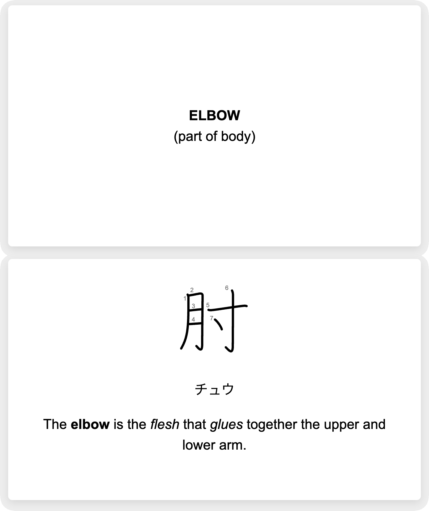
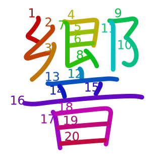

Anki card resources and notes
=============================

This page covers notes relating to creating nice Anki cards for Japanese.

One section covers colorization. In the end, though, I decided that while this looked beautiful, I wasn't convinced that it didn't detract from actually seeing the collection of strokes as a character.

Similarly, I looked at the KanjiVG animation libraries covered below. But the KanjiVG SVGs are trivial to animate and in the end I just used Claude to create a tiny piece of vanilla JavaScript without pulling in any vector graphics libraries or things like JQuery.

See [`kanjivg-animate`](kanjivg-animate) for my Claude created animation for Anki cards. It depends on you having unpacked a [KanjiVG `main` release](https://github.com/KanjiVG/kanjivg/releases) in the same directory.

See [`anki-card-template.html`](anki-card-template.html) and [`rtk-mockup.html`](rtk-mockup.html) for templates/mockups of Anki cards. These depend on having created the Klee One Woff2 font as described below and on the SVG files created by `kanjivg-rename.py` (see [`kanjivg-animate`](kanjivg-animate)).

The `rtk-mockup.html` looks like this:



You need to be running `python3 -m http.server 8000` in this directory, then you can open <http://localhost:8000/rtk-mockup.html> in your browser.

Then if you click on the main kanji, it'll redraw stroke by stroke.

collection.media
----------------

Any image files, sound files, fonts, JavaScript etc. that you want to use in your cards needs to be stored in the Anki `collection.media` directory:

* Windows: `%APPDATA%\Anki2\User 1\collection.media`
* Mac: `~/Library/Application Support/Anki2/User 1/collection.media`
* Linux: `~/.local/share/Anki2/User 1/collection.media`

Subdirectories are not supported in `collection.media` (as confirmed [here](https://forums.ankiweb.net/t/storing-anki-media-in-multiple-folders-is-it-possible/9318/2) by the author of Anki).

The suggested alternative is to use distinct prefixes to group things e.g. prefix all pictures of countries with `countries-`.

Kyoukasho-tai
-------------

[_Klee One_](https://fonts.google.com/specimen/Klee+One) is the nearest thing to a [textbook style font](../../kyoukasho-fonts.md) that's freely available. I'm going to use it for all Japanese text on my cards.

Download a ZIP of the font [here](https://fonts.google.com/share?selection.family=Klee+One:wght@400;600) on Google Fonts.

```
$ unzip -l ~/Downloads/Klee_One.zip
$ ls
KleeOne-Regular.ttf  KleeOne-SemiBold.ttf  Klee_One.zip  OFL.txt
```

Note: the _Klee One_ fonts are covered by the [SIL Open Font License](https://fonts.google.com/specimen/Klee+One/license).

The TTF is 7.8MiB, compress it down to 35% of this size with the WOFF2 web-font format:

```
$ brew install woff2
$ woff2_compress KleeOne-SemiBold.ttf
```

To avoid an issue Anki has with removing files that it thinks are unreferenced:

```
$ mv KleeOne-SemiBold.woff2 _KleeOne-SemiBold.woff2
```

The `_` tells Anki not to delete it.

KanjiVG animation
-----------------

There are no end of animations that show the stroke-by-stroke drawing of the KanjiVG kanji.

E.g. see KanjiVG's own viewer [here for 語](https://kanjivg.tagaini.net/viewer.html?kanji=%E8%AA%9E) (click the animate button).

Or a similar animation [here](https://hochanh.github.io/rtk/%E8%AA%9E/) in [rtk-search](https://hochanh.github.io/rtk/).

The KanjiVG viewer uses NihongoDera's [KanjivgAnimate](https://github.com/nihongodera/kanjivganimate). And rtk-search uses [Draw Me A Kanji](https://github.com/mbilbille/dmak) (most of the heavy-lifting is done by [Raphaël](https://github.com/DmitryBaranovskiy/raphael/), a full-fat JavaScript vector graphics library that feels somewhat substantial for this job).

KanjiVG colorization
--------------------

Both the animation libraries just mentioned handle coloring the strokes on the fly.

If you just want colored versions of KanjiVG SVGs, you can use [KanjiColorizer](https://github.com/cayennes/kanji-colorize) like as follows.

First download the latest KanjiVG release from the [releases page](https://github.com/KanjiVG/kanjivg/releases).

Unpack things and get things ready for the KanjiColorizer script:

```
$ mkdir colorizer
$ cd colorizer
$ mkdir -p kanjicolorizer/data/kanjivg
$ unzip -q -d kanjicolorizer/data/kanjivg ~/Downloads/kanjivg-20250816-main.zip 
```

Download the script:

```
$ curl -L -O https://raw.githubusercontent.com/cayennes/kanji-colorize/refs/heads/main/kanji_colorize.py
$ curl -L --output-dir kanjicolorizer -O https://raw.githubusercontent.com/cayennes/kanji-colorize/refs/heads/main/kanjicolorizer/colorizer.py
```

Run the script and look at its output:

```
$ python3 kanji_colorize.py
$ ls colorized-kanji
0.svg  姿.svg  梯.svg  窈.svg  諾.svg  ...
```

The results look like this:



Give the files a common prefix, so they group nicely, when viewed in Anki's `collection.media` folder:

```
$ cd colorized-kanji
$ for f in *.svg; do mv -- "$f" "_colorized-kanjivg-$f"; done
```
