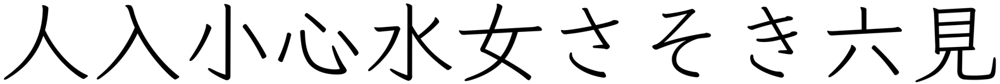

Textbook-style fonts
====================

I started looking at Kyoukasho-tai (textbook style) fonts after filing an [issue](https://github.com/KanjiVG/kanjivg/issues/479) with the KanjiVG project because I felt the mouth radical in their representation of the character 吹 should be noticeably taller.

Here's their version of the character compared with the Hiragino Micho ProN and Hiragino Sans fonts (which are the default Japanese serif and sans-serif fonts on macOS):

As Ben Bullock points out in his response to my issue, there's a distinct group of fonts, called Kyoukasho-tai, that look far closer to the kaisho-tai handwriting style that's taught in schools. And I should be comparing KanjiVG characters against the look of these fonts rather than the classic print fonts.

I'd already been aware that there were some odd differences between how some characters are written and how they look in print, e.g. 人 and 八.

The serif fonts, with their うろこ (the small triangular or hook-like projections) and other features, give more of a hint as to how one might write a character than san-serif fonts (where it's often impossible of distinguish one stroke from the next). However, even serif font characters can look very different to how those characters should look when handwritten.

Aside: for more on うろこ and other features of fonts, see this [page](https://321web.link/fonts-type/) on 321web.

Kyoukasho-tai
-------------

It turns out that Japanese school textbooks use a font style called Kyoukasho-tai (which just means _textbook style_). I found a few of these fonts on the web, and you can see below that characters look quite different when displayed using these fonts rather than classic print fonts.

First, let's take a look at a representative set of characters in the default Japanese sans-serif and serif fonts on macOS:

And now in some Kyoukasho-tai fonts...

EPSON 教科書体Ｍ (available [here](https://www.epson.jp/dl_soft/readme/27767.htm) in a bundle with other fonts, it's the one called `epkyouka.ttf`)

FC教科書体 (available from [Fontke](https://eng.fontke.com/font/226559069/))

YuKyokasho (macOS standard font)

DF [KyoKaSho-W4](https://www.dynacw.co.jp/product/product_download_detail.aspx?sid=3276)

[UD Digi Kyokasho N-R](https://learn.microsoft.com/en-us/typography/font-list/ud-digi-kyokasho) (the standard Windows Kyokasho font)

And now for the Klee fonts that don't claim to Kyoukasho-tai fonts but which strive for a handwritten look...

[Klee One](https://github.com/fontworks-fonts/Klee/)

Klee (macOS standard font)

I'm not sure of the relationship between Klee (which comes as standard on macOS) and the open-source Klee One. They look almost identical except for different [leading](https://en.wikipedia.org/wiki/Leading).

And finally, the [Nihilist KanjiVG font](https://www.nihilist.org.uk/)

Government guidelines
---------------------

The Japanese government's [jōyō kanji document](https://www.bunka.go.jp/kokugo_nihongo/sisaku/joho/joho/kijun/naikaku/pdf/joyokanjihyo_20101130.pdf) goes into the differences they feel one should be aware of between print fonts and handwriting. E.g. on page 9, they cover the vertically elongated mouth radical that got me started on all this:

Brush vs pen
------------

Most of the fonts above have a kind of brush style which results in strokes typically being thicker at one end than the other. This and other characteristics make it easy to determine the start and end of a stroke. This is lost to some degree in pen style fonts like Klee and particularly in the Nihilist KanjiVG font.

Note: KanjiVG isn't primarily about creating a font and has all the information needed for stroke direction to be made clear in various different ways. E.g. the Nihilist font numbers the strokes with the stoke number always appearing at the start of the stroke.

Leading
-------

I mentioned [leading](https://en.wikipedia.org/wiki/Leading) above - this is the term for the space above and below characters. Different fonts enforce different default leading. And this turned out to be surprisingly different in the fonts I looked at above, some enforced very little space above or below the characters (what I would expect) while others enforced really dramatic amounts of space either below (YuKyokasho) or above and below (Klee One). I'd be interested to know the reason for this. Perhaps it e.g. provides more space for things like furigana.

YuKyokasho:

Klee One:

The more "normal" leading of FC-M:

See also
--------

See also this [blog post](https://nihongolaborotterdam.com/2019/12/16/handwriting/) from Nihongo Labo Rotterdam, titled "What I want to tell you about Japanese typeface and handwriting."

The FC-M font comes from this [post](https://community.wanikani.com/t/japanese-font-depository/52874/23) on the WaniKani forums. Derek says it's "the font used in most grade school dictionaries. Similar to the Epson one, but there [are] some differences that probably make this font better since the connecting strokes are a bit smoother."

