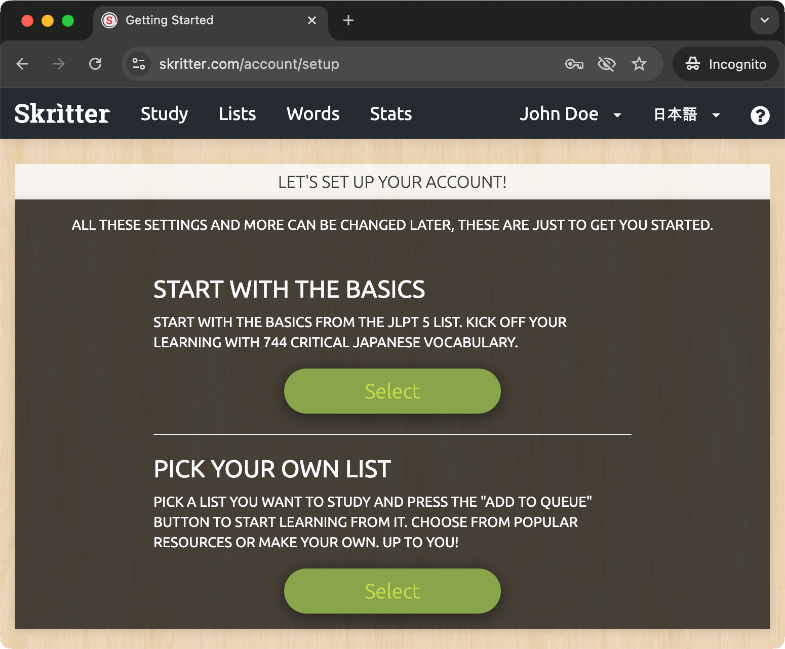
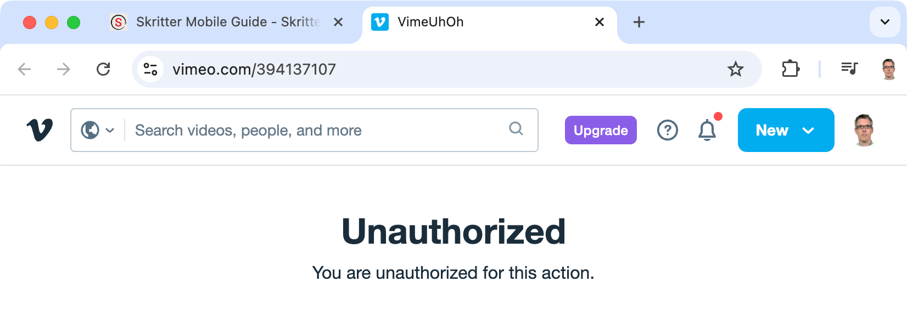
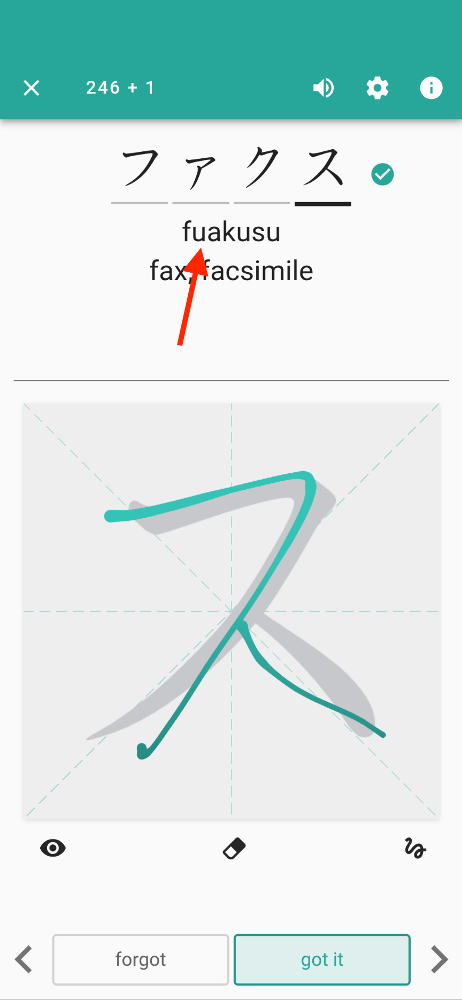
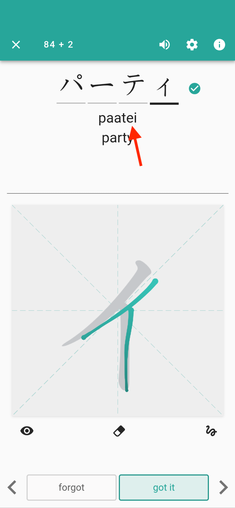
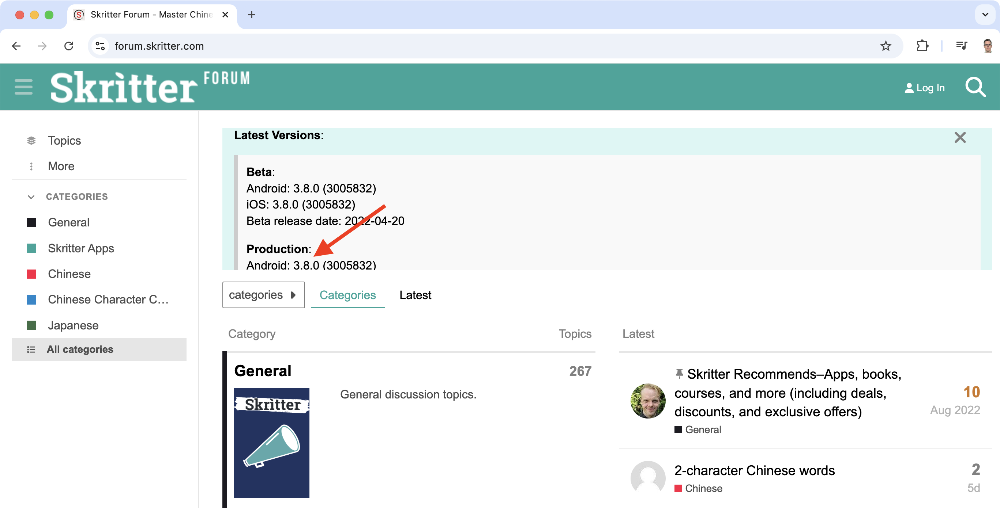

Skritter
========

Beginner decks:

* [Hiragana](https://skritter.com/vocablists/view/5859349090140160)
* [Katakana](https://skritter.com/vocablists/view/6560713457926144)
* [Japanese Stroke Order](https://skritter.com/vocablists/view/5232099579265024)
* [Radicals](https://skritter.com/vocablists/view/44942698)
* [Remembering the Kanji Volume 1, Sixth edition](https://skritter.com/vocablists/view/112160761)
* [Genki 1, Third edition](https://skritter.com/vocablists/view/4567269533941760)
* [JLPT N5](https://skritter.com/vocablists/view/5669108168916992)

Other decks that may be interesting:

* [Jouyou kanji deck](https://skritter.com/vocablists/view/6155907291021312) (see their accompanying [blog post](https://blog.skritter.com/2021/04/new-japanese-jouyou-kanji-decks/) for more details.
* [WaniKani vocab](https://skritter.com/vocablists/view/4920661450031104)

I suspect there are better ways to learn the Jouyou kanji, e.g. WaniKani, and as WaniKani is fairly free format (as I understand it), i.e. it doesn't push you through vocab in a particular order, I'm not sure how the Skritter WaniKani deck will line up with what you learn in WaniKani _but_ it may be useful if you want to learn the stroke order of the characters that you learn via WaniKani.

Skritter have decks, like the N5 one linked above, for the levels N5 thru to N1. They also have kanji decks, e.g. [100 Kanji for JLPT N5](https://skritter.com/vocablists/view/6107563985338368), for each level. However, these are _single_ kanji decks, i.e. individual kanji in isolation and everyone (even Skritter themselves - see the Jouyou blog post linked above) says this isn't the way to learn kanji. But the decks _may_ be useful if you just want to drill the kanji that you must know for a particular JLPT level.

Getting started
---------------

I think I'm growing to like Skritter and in fact I think it's your only real app option for learning stroke order. However, the "getting started" experience isn't great.

I signed up first on the website before installing the app - if you go this route you have to provide a credit card or an activation code (see the payment section below).

If you download the app, there's also an option to start a 7-day free trial or chose from a number or subscription options - it's not very obvious but you can just close this step, continue to the app's main screen and use the many free decks that they have.

If you're serious about using Skritter, I think you should take up the 7-day free trial from the start (or select a subscription) as without a trial or subscription, you can't use the [SRS](https://en.wikipedia.org/wiki/Spaced_repetition) feature which is where the main value is (instead, you can just drill a particular deck, i.e. work thru all the cards in a random order).

After the payment step, it assumes, you want to learn Chinese and so asks you what type of characters (simplified or tranditional) you want to learn.

Even if you flip to Japanese, the question remains:

Then it asks you if you want to _start with the basics_ or _pick your own list_, I went with the first option.

This was the first poor experience, it chose a deck called "Old JLPT N5" that rather inconsistently has an icon that clearly says "JLPT N2".

So, you're very first question is "why, as my very first deck, are they giving me something that they seem to be indicating is out-of-date" and do they have a bug with their deck icons.

If you browse the available decks, you can find that they have another deck called "JLPT N5" (where the deck icon matches its name). So why don't they set you up with this deck? Or with the one of the nice basic hiragana or katakana decks that they have?

Once, I'd got this far, I then went and installed the _Skritter: Write Japanese_ app on my phone and signed in using the account I'd just created.

First, it walks you thru some basic Skritter usage and then dumps you on a main page that initially looks rather visually confusing.

But actually most of the things that I initially thought were setup elements or elements of the UI were essentially just newsfeed items - you can click on them and e.g. find out what new features have been added to the app recently.

Once I'd clicked those away (clicked the eye icon on each), the main screen looked a bit more digestable:

But it's not very clear what you should do - even though you've got one deck sitting there, you're told there are no cards due.

I think at this point, they should probably push you straight to a YouTube video that walks you thru a first session with Skritter. Instead you have to hunt for this - if you press the ☰ "hamburger" icon (upper left) and select _Help_, the first item there is the _Skritter Mobile Guide_ which features a useful video and links to explanations of all the elements.

The exact same content is also available on their website - see [_Skritter Mobile Guide_](https://docs.skritter.com/article/214-skritter-mobile-guide).

Note - if you click the link below the video, that should take you to the same video on Vimeo, you just get:

It seems they've got things currently set up so that this video is restricted so it can only be played back if embedded in their site.

But they do also have the video available [here](https://www.youtube.com/watch?app=desktop&v=gQaWYWn1HD0) on YouTube (so maybe they should update their website to point to this content, Vimeo has kind of gone to hell in the last few years and the playback for content hosted there can be slow to start).

Anyway, it turns out that you have to _learn_ content first before it starts appearing as due or avaiable for review.

So, right from the start, I find this a very odd aspect of Skritter - if you start working with a deck, there's no way to say "I'm already largely familiar with this content, I just want to review it," instead you have to let Skritter teach you the content first, i.e. present the cards in a learning mode and for each card you have to click _Mark as Learned_.

This is quite exasperating and seems to imply Skritter thinks you'll never have learn anything independent of being taught it by Skritter. So, if e.g. you already know the content of the hiragana and katakana decks then look forward to clicking the _Mark as Learned_ button 139 times and 151 times for each respectively to convince Skritter of this.

The alternative is to untick the _Learned only_ toggle for such decks when you hit the _Test_ button for them. But then the cards are never added to the SRS system and so never appear as _Due Cards_.

Gestures
--------

To continue to the next card, you can just tap the canvas, i.e. the area where you just drew the last character, rather than having to press the _got it_ button.

Rather than hitting the erase button, you can just swipe upwards.

Losing progress
---------------

If you want to exit test mode, you'll lose all your progress - you can't exit and resume later:

More problematic than this is that the same thing happens if you have to switch to another app, e.g. to reply to an email or take an incoming phone call. Whether this happens or not depends on how much "work" you do outside Skritter (if you just quickly flip to another app and then back things are usually OK) but if Android needs e.g. memory for the foreground app, it takes it from other apps - normally apps handle this well, they just persist their current state when this happens and then restore it once the user brings them to the foreground again (the whole thing is transaparent to the user). But in Skritter's case, it loses your current progress.

This causes me to select to only review e.g. 50 cards rather than all that are outstanding. I then keep on reviewing in blocks like this until I've reviewed everything. I do it like this to avoid losing too much progress if the above issue kicks in.

Issues with the kana decks
--------------------------

In the katakana deck, ファクス is written as fuaksu (which would be フ followed by a large ア) rather than fakusu. They've got another card that correctly has fa as the romaji for ファ:

| Incorrect "fua" | Correct "fa" |
|-----------------|--------------|
|  |  |

Similarly, I don't think there's any romanization system where パーティ becomes paatei (which would be テ followed by a large イ) and I think party is normally written with both vowels long, i.e. パーティー which would be pātī or paatii:

And I thought I was going mad when I repeatedly seemed to be getting it wrong as to whether to use hiragana or katakana for wanwan. But it's in both the hiragana and katakana deck:

| Hiragana | Katakana |
|----------|----------|
|  |  |

Interestingly, neither is the definitive spelling - each seem to be common according to the National Diet Library [ngram viewer](https://lab.ndl.go.jp/ngramviewer/):

So, while both are technically correct, it would be nice if each card was clearly tagged to indicate whether the hiragana or katakana spelling was expected.

Corrections
-----------

To correct issues, like those above, go to the deck, find the word and click on it (or just press the upper-right ⓘ  button when on a card during review) and then press the pencil icon (lower right).

You only seem to be able to change the description rather than the romaji, i.e. you can add "fakusu" to the description (that contain the English definition "fax") but you can't correct the "fuaksu".

Make sure to hit the save button (lower right) rather than just pressing the back button (upper left) after making changes.

**Update:** for decks provided by Skritter, i.e. ones you didn't create yourself, you don't have much ability to edit (beyond editing the description and mnemonic). But if you make a copy of a given deck (open the deck, click the upper-right three dots icon - ⋮ - and select _Copy_), you then have much more edit control, as described in the editting section of this [page](https://docs.skritter.com/article/271-making-and-editing-custom-decks-on-mobile).

For Skritter decks, you can go to the page for a card and at the bottom of the page, there's a _Submit Correction_ button.

Raw squigs
----------

Skritter calls the strokes you make "squigs". By default, after you enter each squig, it's snapped to a perfect version of the stroke. While this is a fun feature initially, I think you should disable it (they even recommend this in the introductory video linked to above). So, just go to settings and toggle on the _Raw squigs_ option and you'll get a more "honest" picture of how well your squigs match the strokes you're aiming for.

Other UI issues
---------------

* Decks that I'd started using didn't always then appear in the _Recent Decks_ section and I'd have to browse for them. After a while they would be appear in _Recent Decks_.
* When logged in, you can change your password without knowing your existing password - not _such_ a big deal but perhaps indicative of a somewhat casual approach to account security.
* It's definitely far more forgiving for some characters than others, e.g. almost anything I enter gets accepted for ワ but it's extremely unforgiving for how I enter ひ.
* When you get a stroke wrong repeatedly, the stroke is displayed in blue but the stroke direction is not - I kept entering the first stroke for よ in the same direction as the first stroke for ヒ and not understanding why Skritter wouldn't accept my stroke even if I did it exactly over the blue stroke being shown. Now I'm aware what might be happening and try changing direction in similar situations but it was very non-obvious first time.

Latest version
--------------

If you go to the Google Play store, it's clear the app is updated frequently - the last version had come out a few weeks earler when I took this screenshot:

However, every page on the [Skritter Forums](https://forum.skritter.com/) tells you that the most recent version came out in 2022:

This made me think development of the application was long dead - perhaps it's time for them to remove this banner if it's not being updated.

Payment
-------

For payment, the most direct option is to provide a credit card and, if you have one, enter a coupon code that gives you a discount on your subscription.

Skritter is used by academic institutions and activation codes are a mechanism that allows them to provide codes to students to enable them to signup for Skritter without requiring personal credit card details.

Like coupons, short-lived activation codes are sometimes given out for promotional purposes.

Reviews
-------

The always excellent Tofugu has a short review of Skritter [here](https://www.tofugu.com/japanese-learning-resources-database/skritter/).

Robin MacPherson has a YouTube review of Skritter [here](https://www.youtube.com/watch?v=5Pglt4az_N0).

JoyoKanjiKai's [review](https://www.joyokanjikai.com/learning-japanese/skritter-review/). Unlike Tofugu and Robin MacPherson, I haven't developed an opinion on JoyoKanjiKai, I list his review as it seems fairly in-depth.
