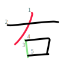
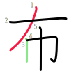
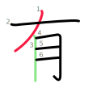

Stroke order
============

Even before you've finished learning the basic kana, it's clear that there are no hard and fast rules to stroke order.

The hiragana and katakana _mo_ characters look somewhat similar, yet their stroke order is different:

| Hiragana                                                  | Katakana                                                  |
|-----------------------------------------------------------|-----------------------------------------------------------|
|  |  |

Even experienced teachers can find themselves corrected on this one - e.g. see this [video](https://www.youtube.com/watch?v=uOJVWVONTw8) where _ToKini Andy_ discovers that he's been getting the order wrong for twelve years (see the intro and in more detail 1hr 4min 38s into the video).

When introducing stroke order, most sites and videos don't go much beyond the basic top-to-bottom left-to-right rule. Skritter has a nice [blog post](https://blog.skritter.com/2021/05/the-ultimate-guide-to-japanese-stroke-order/) that provides a more in-depth set of rules:

1. Top to bottom.
2. Left to right.
3. Left-sloping stroke before right-sloping stroke.
4. Horizontal strokes before crossing vertical stroke, with an exception.
5. Framing strokes before box contents, but closing stroke last.
6. Skewering stroke last.
7. Symmetrical additions last.
8. Additional dots last.

The fact that they felt it necessary to tag on an exception to rule 4, that they didn't cover in the accompanying video, shows it's hard to come up with even a basic set of rules.

**Update:** ToKini Andy presents a fairly similar set of rules with a bit more details in videos two and three of his [JLPT N5 kanji series](https://www.youtube.com/playlist?list=PLA_RcUI8km1ME3ewzc4pcJ-cA-cw0-nKa).

It would better to call these guidelines than rules as even within the first kanji that you learn, you'll find exceptions. The stroke order is a product of the historical development of how these characters were drawn and sometimes this has surprising consequences.

The best known example, within the first 100 kanji that you typically learn, is 右 and　左 (left and right). Despite their similarity, they have different first strokes:

| Right                                                        | Left                                                          |
|--------------------------------------------------------------|---------------------------------------------------------------|
|  |  |

There are historical explanations for this difference (e.g. see this [post](https://community.wanikani.com/t/stroke-order-or-wait-why-are-those-different/32862/4) on the WaniKani forums and this [answer](https://japanese.stackexchange.com/a/965/66028) on the Japanese StackExchange).

You can construct a simple rule to distinguish the two cases - "look at the third stroke in both cases, if it's horizontal then the first stroke is also horizontal and if it's vertical then the first stroke is the vertical left-sloping stroke."

**Note:** from now on, I'll call the vertical left-sloping stroke the **diagonal** stroke.

| Right                                                        | Left                                                          |
|--------------------------------------------------------------|---------------------------------------------------------------|
|  |  |

This rule holds up for a while with other characters, e.g. horizontal first:

And e.g. vertical first:

 

But the rule, so far, doesn't cover the case where the third stroke is vertical but _cuts_ the diagonal:

 

So the final rules becomes "if the third stroke is vertical and does **not** cut the diagonal stoke then the diagonal is the first stroke otherwise the horizontal one is."

**Credit:** I didn't come up with this rule, it comes from [TfsQuack](https://www.reddit.com/user/TfsQuack/) in this Reddit [post](https://www.reddit.com/r/LearnJapanese/comments/xjt8rv/comment/ipac7dn/).

But there's more...
-------------------

The horizontal/vertical rule doesn't apply once the first two strokes no longer cross:

| Right                                                        | Stone                                                        |
|--------------------------------------------------------------|--------------------------------------------------------------|
|  |  |

So all the special-casing is just for the crossing case. In the case of 石, the first two strokes don't cross and are unaffected by the third stroke - you just use the stroke order you'd expect from the basic stroke-order rules.

Cuts and fonts
--------------

As TfsQuack points out, there's a problem with the _cutting_ part of the rule as it's impossible to see if the third stroke cuts the diagonal one with many fonts.

This is a problem particularly with [sans-serif](https://en.wikipedia.org/wiki/Sans-serif) fonts. E.g. here with [BIZ UDGothic](https://fonts.adobe.com/fonts/biz-udgothic):

Fortunately, the cutting is visible with the default sans-serif Japanese font on macOS, [Hiragino Sans](https://en.wikipedia.org/wiki/Hiragino):

Unlike sans-serif, the cutting is usually clear in serif fonts, e.g. Hiragino Mincho:

With handwriting-style fonts, things tend to be fairly hit or miss, e.g. the cut is clear with [Klee](https://fontworks.co.jp/fontsearch/KleePro-M/):

But is not visible in fonts going for a modern "fun" look, e.g. [Tsukushi Round Gothic](https://en.fontworks.co.jp/fontsearch/tsukuardgothicstd-l/):

So, this is a good reason to choose your font carefully when using one in e.g. Anki decks. Make sure that it's a font where you can see the cuts shown above and make sure that it's a font that doesn't have the issue resulting from [Han unification](https://en.wikipedia.org/wiki/Han_unification) (covered in more details elsewhere in this repo) where characters are displayed as a non-Japanese variant such as Chinese. E.g. the character [直](https://jisho.org/search/%E7%9B%B4%20%23kanji) looks very different in Japanse and Chinese:

| Japanese                                                           | Chinese                                                            |
|--------------------------------------------------------------------|--------------------------------------------------------------------|
|  |  | 
