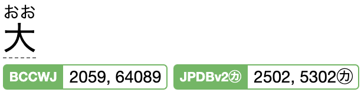

Yomitan
=======

[Yomichan](https://github.com/FooSoft/yomichan) was the main browser extension for hovering over words on any webpage to see dictionary definitions.

**However**, the extension repo has been archived and the project sunsetted (see announcement [here](https://foosoft.net/posts/sunsetting-the-yomichan-project/)).

And the batton has been passed to Yomitan (see announcement [here](https://foosoft.net/posts/passing-the-torch-to-yomitan/)).

The Yomitan website is [here](https://yomitan.wiki/) and its GitHub repo is [here](https://github.com/yomidevs/yomitan).

**Update:** [Migaku](https://migaku.com/) (covered in the main [`README.md`](README.md) in relation to video) also has a reading extension - I wonder how it compares to Yomitan - does it complement or compete/beat Yomitan?

Yomitan dictionaries
--------------------

After installing Yomitan, you have to install dictionaries - this is a bit confusing and I think they could have just clearly pointed out that the there's a _Get recommended dictionaries_ button in the extension's settings and you can just get these to start with rather than being overwhelmed with options.

Another oddity of Yomitan is that they still support displaying pitch accents (which many people consider to be a super important but under discussed aspect of Japanese) but they no longer include a link to where to retrieve one. The reason for this is covered in issue [#227](https://github.com/yomidevs/yomitan/issues/227), **TL;DR** they've decided the licensing isn't clear so removed reference to the dictionary they were using and leave it up to you to discover and download it.

You can find an old version (from August 2022) on the archived Yomichan repo on the [`dictionaries` branch](https://github.com/FooSoft/yomichan/tree/dictionaries) (search for "kanjium_pitch_accents.zip").

However, the dictionary is generated from the `accents.txt` file found [here](https://github.com/mifunetoshiro/kanjium/tree/master/data/source_files/raw) in the Kanjium repo. And this is updated very occasionally with corrections and additions (see [commit history](https://github.com/mifunetoshiro/kanjium/commits/master/data/source_files/raw/accents.txt)) and has some updates since 2022.

The `accents.txt` file can be downloaded and then converted to a Yomitan dictionary using the script [here](https://github.com/toasted-nutbread/yomichan-pitch-accent-dictionary) from toasted-nutbread (this is the same script used to create the archived `kanjium_pitch_accents.zip` linked to above).

Usage and layout
----------------

Hold down `shift` and hover over a Kanji to see a popup with dictionary definitions.

I'm not crazy on the layout used in the popup but maybe I'll get used to it with time.

Basically, it munges input from all the underlying dictionary into a definition for a particular reading of the kanji. As there are multiple readings for every kanji, you get a list of such definitions, starting with the most common reading.

A definition starts with the kanji (with furigana) which you can click on to see the stroke order (and further details from the JANJIDIC dictionary).

And you see little green boxes showing e.g. "[BCCWJ | 288, 335]" which means this is the 288th most frequently used reading of the kanji in the BCCWJ frequency dictionary.

Anyway, the frequency gives you some kind of indication as to the importance of a particular reading.

See [here](https://learnjapanese.moe/yomichan/#recommended-frequency-dictionaries) for some indication as to how to interpret these numbers. Basically if the number is higher than 30,000 then it's "kind of uncommon".

If you've installed `kanjium_pitch_accents.zip` then you'll see the hiragana for this reading with a bar over those where the pitch goes up.

And finally, you get a classic foreign-language-dictionary style entry (from Jitendex) where it shows what the kanji means in English, it's grammatical role etc.

Audio
-----

You can click the audio button beside an entry to hear it spoken. However, many many entries have this button but no related audio (you click the button, it tries to retrieve the audio and gets nothing - only then is a little X added to the icon to indicate there's no audio). Initially, I thought I'd hit some kind of bug but it just seems to be that there's only audio for some small subset of entries. It's a pity they can't hide the audio button in these cases.

Japanese to Japanese
--------------------

The native Japanese dictionary that both _Matt vs Japan_ ([here](https://www.youtube.com/watch?v=5oxdPY9eH48&t=132s)) and _ToKini Andy_ ([here](https://youtu.be/OJxndUGN8Cg?t=120s)) is Suupaa Daijirin.

Daijirin is a popular Japanese dictionary and Suupaa Daijirin (aka Sūpā Daijirin aka スーパー大辞林) is a version of this dictionary (see its Wikipedia [entry](https://en.wikipedia.org/wiki/Daijirin)).

I suspect you're supposed to buy the electronic version of this dictionary (which comes in a standardized [EPWING](https://en.wikipedia.org/wiki/EPWING) format) and then import it into Yomitan (which supports importing the EPWING format - see [here](https://github.com/yomidevs/yomitan-import)).

I haven't tried installing it - I suspect many people are simply "acquiring" ZIPs of the dictionary and I don't know where you can buy it legally.

Yomitan and Anki
----------------

See _ToKini Andy_'s [video](https://youtu.be/OJxndUGN8Cg).

Numbers
-------

Sometimes you see two frequency numbers for a given Yomitan definition:

The two numbers mean completely different things for BCCWJ and JPDB:

* For JPDB, the first number is the frequency of this reading and the second is the frequency with which this kanji is instead written using the kana of this reading, i.e. おお in this case. See [here](https://github.com/Kuuuube/yomitan-dictionaries?tab=readme-ov-file#jpdb-v22-frequency-kana-recommended) and note that the second number is following by a little ㋕.
* For BCCWJ, the first is the short-unit frequency and the second is the long-unit frequency - this is quite useful and the meaning is explained [here](https://community.wanikani.com/t/ordering-vocab-by-frecuency/35122/2).
